#  Get Started with Oracle Cloud Free Tier

## 📘 Introduction

Before you get started, you will need an **Oracle Cloud account**.  
This lab will guide you step-by-step to:

- Create your **Oracle Cloud Free Tier** account
- Sign in to your cloud tenancy

## 🧾 Existing Cloud Accounts

> If you already have access to an Oracle Cloud account, skip to **Task 2** to sign in to your cloud tenancy.

## 🎯 Objectives

- ✅ Create an Oracle Cloud Free Tier account  
- ✅ Sign in to your Oracle Cloud account

## 🛠️ Prerequisites

- A **valid email address**  
- Ability to receive **SMS text verification** (only if your email isn't recognized)

> ⚠️ **Note:** Interfaces in the following screenshots may look slightly different from what you will see on your screen.

## 📝 Task 1: Create Your Free Trial Account

> If you already have a cloud account, skip to **Task 2**.

1. 📧 **Validate that you received an email** in the following format from Oracle’s marketing and click the link for registration — or copy it into your browser.

2. 💡 An alternative option — in case you didn’t receive a marketing email — is to open a web browser and go directly to the [Oracle Cloud account registration form](https://www.oracle.com/cloud/free).

3. 📄 In both cases above, you will be presented with a **registration page**.

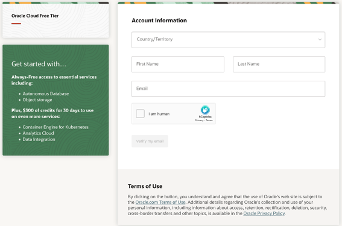

4. 📝 Enter the following information to create your **Oracle Cloud Free Tier** account:

   - 🌍 Choose your **Country**
   - ✍️ Enter your **Name and Email**
   - ✅ Use **hCaptcha** to verify your identity

5. 📧 Once you’ve entered a valid email address, click the **Verify my email** button.  
   The next screen will appear — click **Select Offer** to proceed.

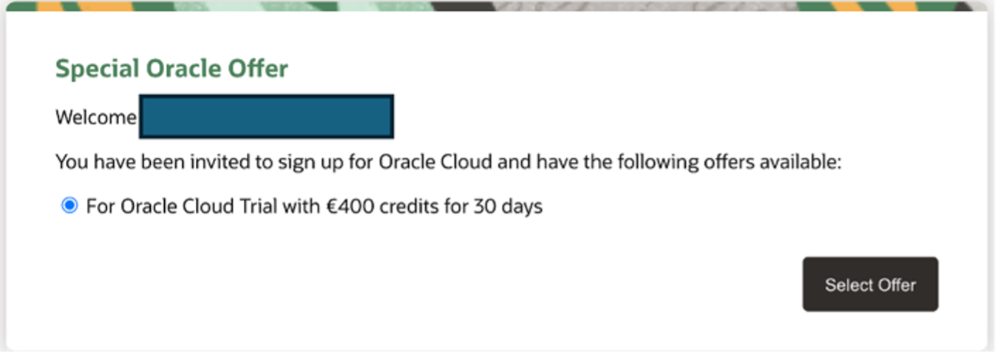

After clicking **Verify my email**, wait for the **"Email verification link sent"** notification.

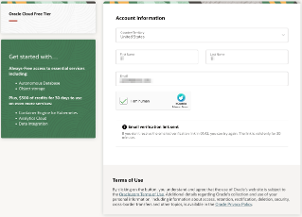

6. 📬 Check Your Email for Validation Link

Go to your inbox. You will receive an **account validation email** from Oracle.  
The email will be similar to the one shown below:

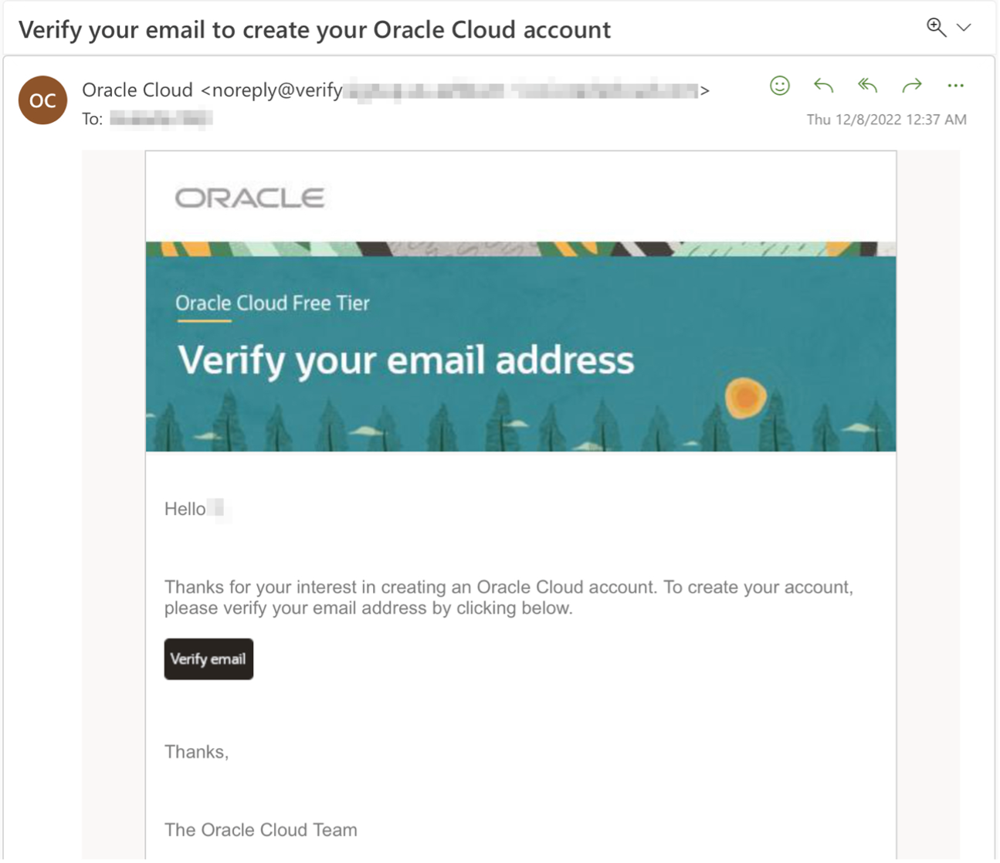

7. 🔐 Click "Verify email"

After receiving the verification email, click the **Verify email** button to proceed.

8. 📝 Complete Your Account Information
Fill out the following details to create your **Oracle Cloud Free Tier** account:

- 🔑 **Choose a Password**
- 👤 **Customer Type**: Change to **Individual**
- 🆔 **Cloud Account Name** will be generated automatically — you can edit this value.  
  > ⚠️ *Remember the name you set — you’ll use it to sign in later.*
- 🌍 **Choose a Home Region**: For example, **Frankfurt**  
  > ❗ *The Home Region **cannot be changed** once selected.*
- ☑️ **Acknowledge** the terms by checking the box
- 👉 **Click Continue**

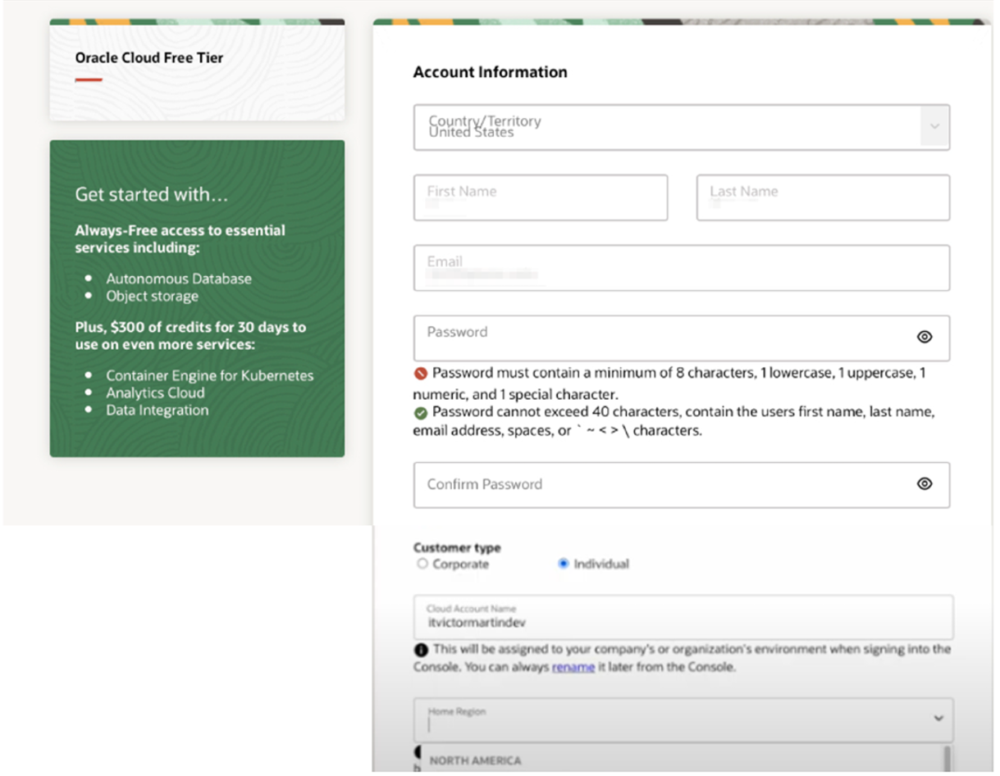

9. 🏠 Enter Your Address Information

Enter your address details:  
- Select your **Country**
- Enter a valid **Phone Number**

Then, click **Continue**.

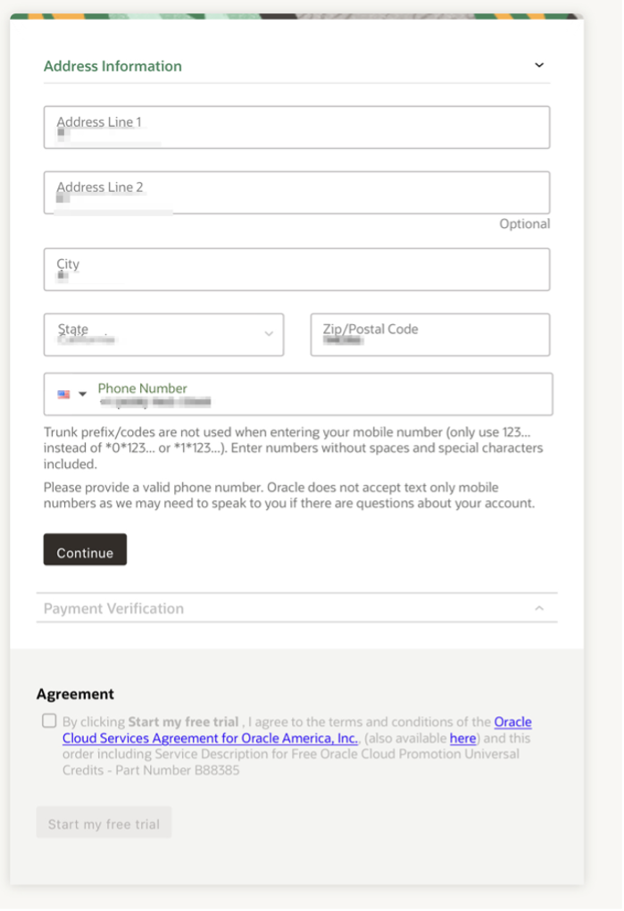

## 10. 💳 Add Payment Verification Method

Click the **Add payment verification method** button to continue the registration process.

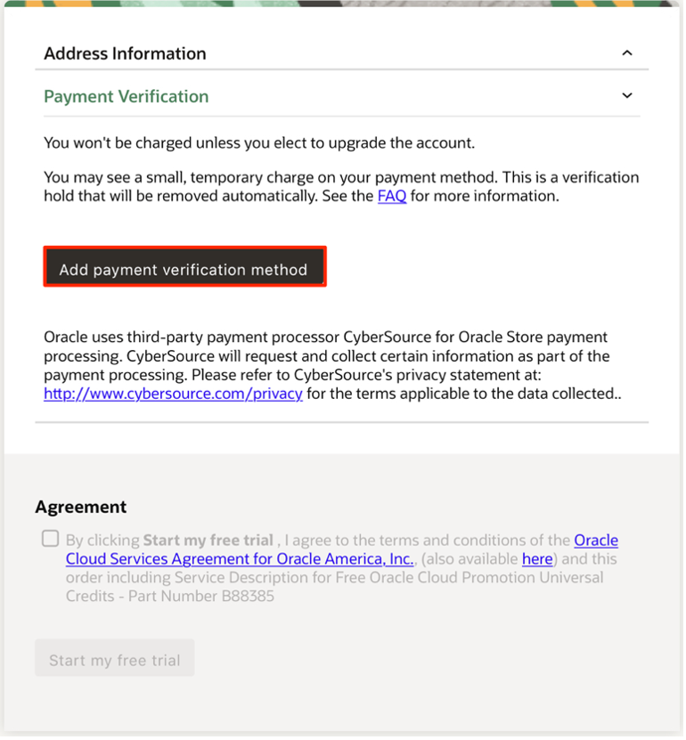

## 11. 💳 Choose Your Verification Method

Select the **Credit Card** option.  
Enter your **payment details** as required.

> ⚠️ **Note:** This is a **free credit promotion** account.  
> You will **not be charged** unless you choose to upgrade the account later.

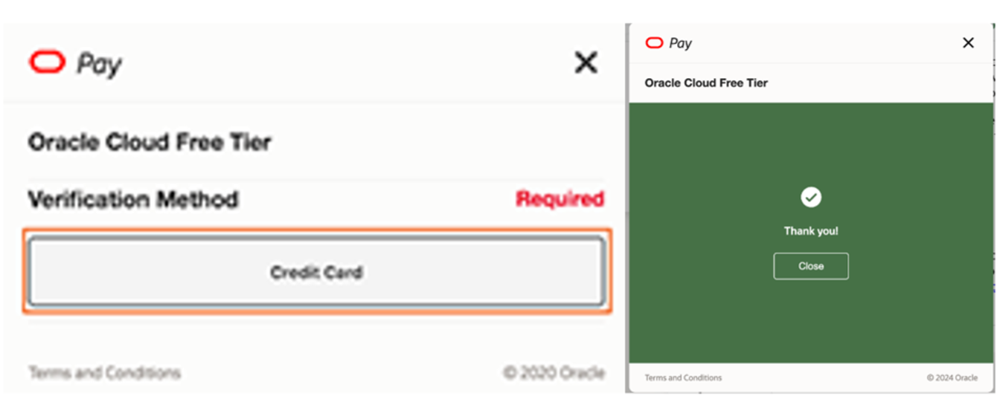

## 12. 🚀 Start Your Free Trial

Once your **payment verification** is complete:

- ✅ Review and accept the **agreement** by checking the box
- 🎉 Click the **Start my free trial** button to activate your account

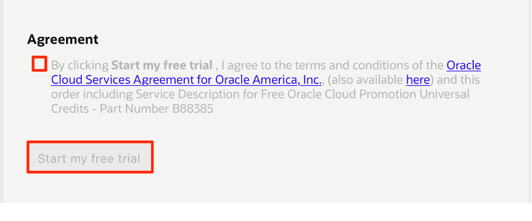

## 13. ⏳ Account Provisioning

Your account is now **provisioning** and should be available soon!

> 💡 Tip: You may log out while waiting for provisioning to complete.

You’ll receive an **email notification** from Oracle once the process is finished.  
This email will include your **cloud account name** and **username**.

# 🧩 Task 2: Sign In to Your Oracle Cloud Account

> ⚠️ **Note:** When your tenancy is first created, you might only see a **direct login** screen.  
> Once your tenancy is fully provisioned, you will see the full login interface as shown below.

## 1. 🔐 Sign in via Oracle Cloud

- Go to [**cloud.oracle.com**](https://cloud.oracle.com)
- Enter your **Cloud Account Name** and click **Next**

> 🔎 This is the name you chose in **Task 1 / Section 8** — _not_ your email address.  
> If you've forgotten it, refer to the **confirmation email** from Oracle.

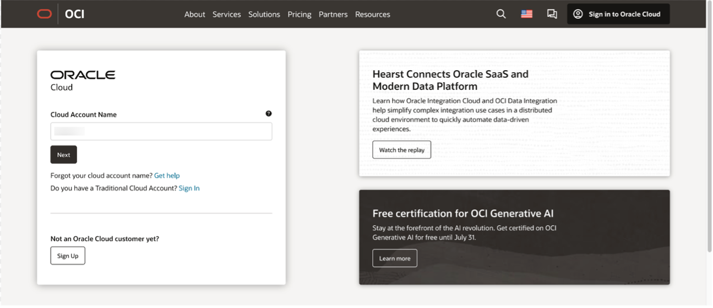

## 2. 🔄 Continue with Oracle Identity Service

Click **Continue** to sign in using the _"oraclecloudidentityservice"_ authentication provider.

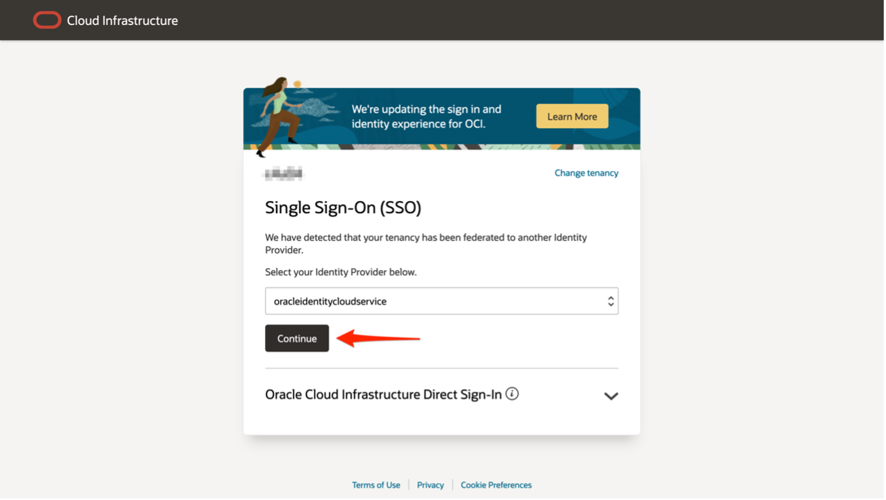

## 3. 🔑 Enter Your Credentials and Sign In

When you sign up for an Oracle Cloud account, a user is automatically created for you in **Oracle Identity Cloud Service** with the username and password you selected.

You can use this **single sign-on** option to access Oracle Cloud Infrastructure and other Oracle Cloud services without re-authenticating.  
This user has **administrator privileges** for all the services included with your account.

### 🧾 Sign-In Instructions

- Enter your **Cloud Account username** → _(this is your email address)_
- Enter your **password** → _(the one you created during sign-up)_
- Click **Sign In**

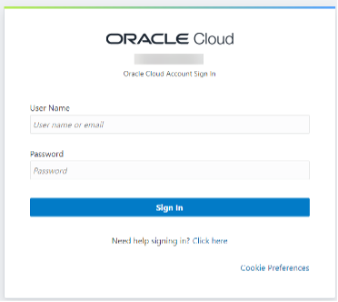

## 4. 🛡️ Enable Secure Verification

You will be prompted to enable **Secure Verification**.

Click **Enable Secure Verification** to proceed.

For more details, refer to the [Managing Multifactor Authentication documentation](https://docs.oracle.com/en-us/iaas/Content/Identity/Tasks/usingmfa.htm).

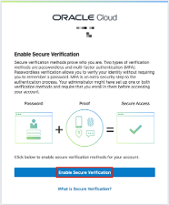

## 5. 📲 Choose Verification Method

Select a method to enable secure verification:

- **Mobile App** (e.g., Oracle Mobile Authenticator, Google Authenticator)
- **FIDO Authenticator** (hardware-based authentication)

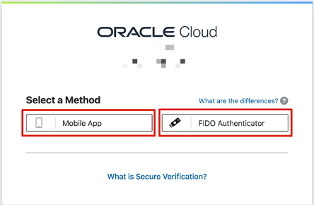

## 6. 📱 Set Up Authentication via Mobile App

Choose **Mobile App** as your verification method.  
Follow the steps shown in the screenshot to complete the authentication setup.

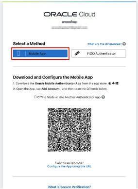

## 7. 🎉 You're In!

Once you've successfully verified your authentication, you will be **signed in to Oracle Cloud**!

Welcome to your Oracle Cloud dashboard 🚀

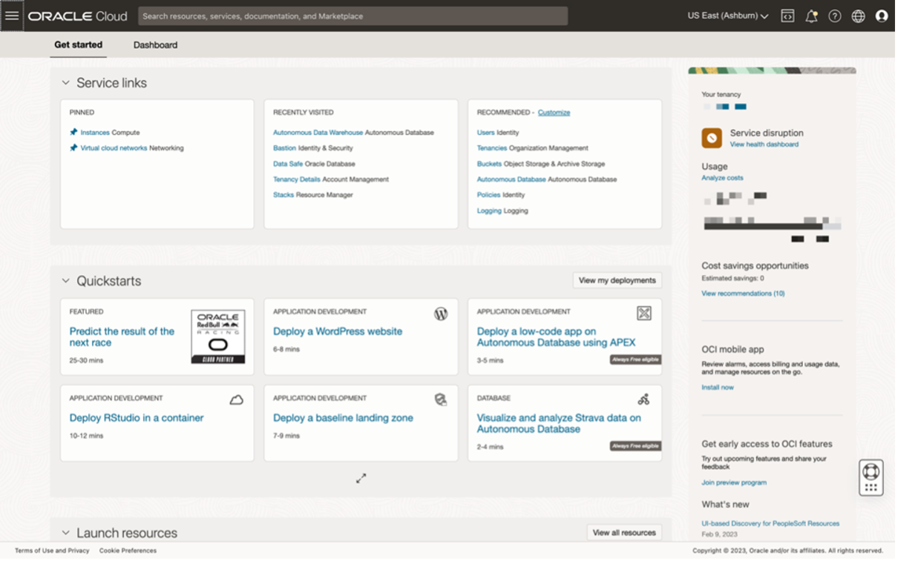

## 8. 🔁 Alternate View: Navigate to OCI Console

In case you see a different view after signing in, follow these steps:

- Click on your **Profile** in the top right corner
- Select **OCI Console** to access the full Oracle Cloud interface

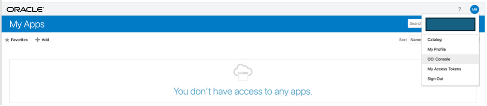