# LAB 1 – Deploying MuShop Locally Using Docker


## 📘 Introduction

In this lab, you’ll deploy the MuShop reference application locally using Docker.  
This is the first step in exploring Oracle Cloud Native tools and microservices.


## 🧩 Task 1: Log in to Your OCI Tenancy

Begin by logging into your **OCI Dashboard** to retrieve the necessary configuration and resource details.


### 1. 🔐 Access Infrastructure Dashboard


Click on **Infrastructure Dashboard** from the homepage.


## 🧩 Task 2: Create a Virtual Cloud Network (VCN)


### 1. 🌐 Set Up a New VCN

- Go to **Networking** in the OCI sidebar
- Navigate to **Virtual Cloud Networks**
- Click **Start VCN Wizard**
- Select **VCN with Internet Connectivity**
- Click **Start VCN Wizard** to begin the creation process


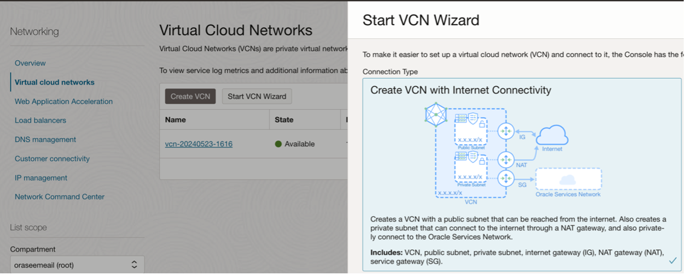

### 2. 🛠️ Enter VCN Configuration Details

- **VCN Name**: `okeworkshop`
- **Compartment**: Choose the **root compartment**


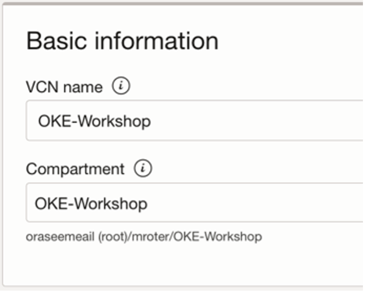


- **VCN CIDR Block**: `192.168.0.0/16`
- **Public Subnet CIDR Block**: `192.168.1.0/24`
- **Private Subnet CIDR Block**: `192.168.2.0/24`


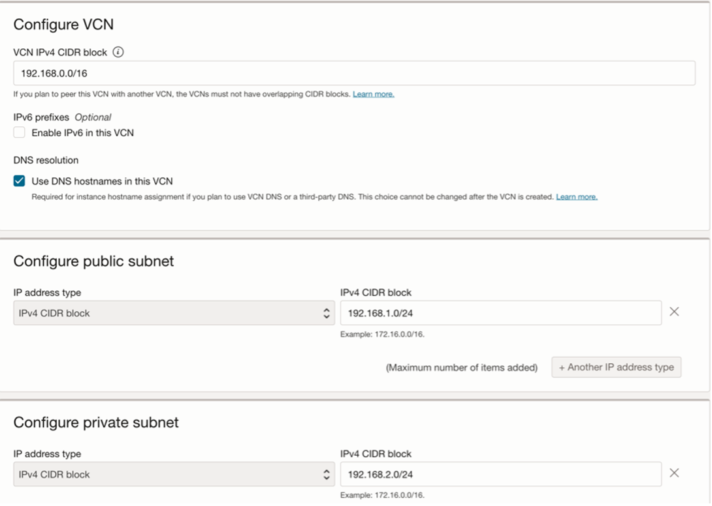

- Click **Next**
- Validate that all the information is correct
- Click **Create** to provision the VCN


### 5. 👀 View Your VCN

- Click **View VCN** on the bottom left of the wizard.

> **Note:**  
> This process creates a Virtual Network with the following components:  
> - **VCN**
> - **Public Subnet**
> - **Private Subnet**
> - **Internet Gateway (IG)**
> - **NAT Gateway (NAT)**
> - **Service Gateway (SG)**


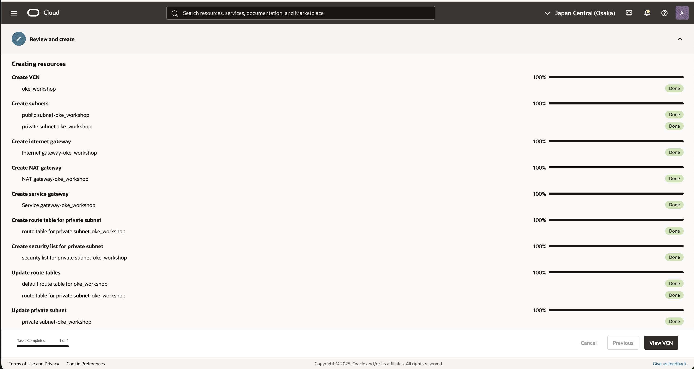


### 6. 📊 View Configured VCN Details

The following screen displays the full configuration of your **VCN**, including subnets, gateways, and other components.

> 🧠 **Tip:**  
> If no information is displayed, go to **List Scope > Compartment**, and ensure the correct compartment is selected.


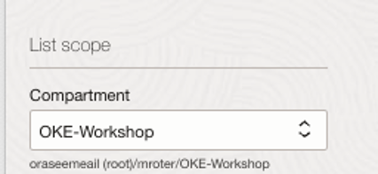


# 🧩 Task 3: Configure Security List for Public Access


### 1. 🛡️ Access the Default Security List

In the **VCN view**, navigate to:

- **Resources** > **Security Lists**
- Click on the **Default Security List** for your VCN ( `<VCN Name>`)

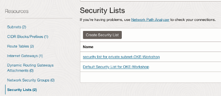

### 2. ➕ Add Ingress Rules

- In the **Default Security List** view, click on **Ingress Rules**
- Then, click **Add Ingress Rules**
  
  ### 3. ⚙️ Configure Rule Details

In the **Add Ingress Rules** panel:

- **Source CIDR**: `0.0.0.0/0`
- **Destination Port Range**: `All (default)`

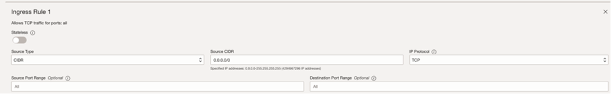

- Click **Add Ingress Rules**
- Validate that the new rule appears in the list

Also confirm the **Egress Rule** allows traffic to:  
- `0.0.0.0/0` _(default)_

# 🧩 Task 4: Import Custom Image


### 1. 🧭 Navigate to Custom Images

In the OCI Console:

- Go to **Menu** > **Compute** > **Custom Images**


### 2. 📥 Import Image from Object Storage URL

Fill out the following:

- **Compartment**: Select the appropriate compartment
- **Name**: Provide a descriptive name (avoid confidential data)
- **Operating System**: Select **Ubuntu**
- ✅ Enable: **Import from an Object Storage URL**
- **Object Storage URL**:  

https://objectstorage.uk-london-1.oraclecloud.com/p/2o164n0KlkY--neE-r78QVLUySU1ELPfxPB4cPhKTaApNEDzQzhWm86En4aFGaaR/n/oraseemeail/b/bucket-oke-workshop/o/exported-image-20241117-1641


- **Image Type**: VMDK (default)
- **Launch Mode**: Paravirtualized (default)


### 3. ✅ Finalize Import

- Click **Import Image** to begin the upload

> ⚠️ **Note:** If you get an **“invalid source URL”** error, make sure there are **no spaces** at the beginning or end of the URL.

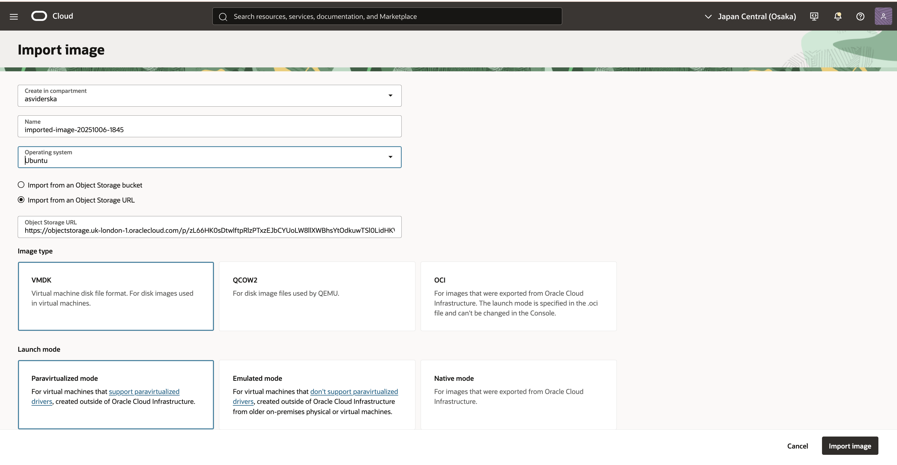


### ⏳ Wait for Image Upload to Complete

After clicking **Import Image**, the upload process will begin.  
Please wait until the image is **fully uploaded and processed** before proceeding to Task 5.


# 🧩 Task 5: Create a Compute Instance


### 1. ➕ Launch a New Instance

- Navigate to **Compute** > **Instances** > **Create Instance**


### 2. 📝 Configure Instance Settings

Fill out the following details:

- **Instance Name & Compartment**: Enter appropriate values
- **Placement**: `Frankfurt-AD1` (default)
- **Security**: `Default`
- **Image Source**:  
  Go to **Select Image and shape** > click **Change image**


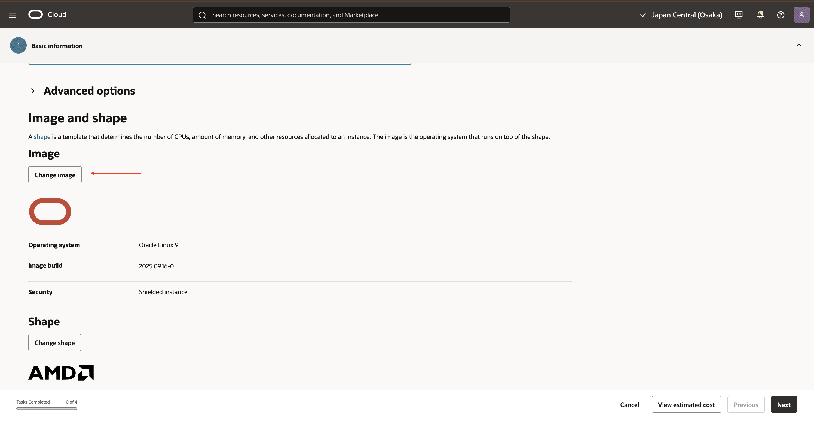

- Select **My images** > **Custom images** > **Uploaded in Task 1** > click **Select image**
  
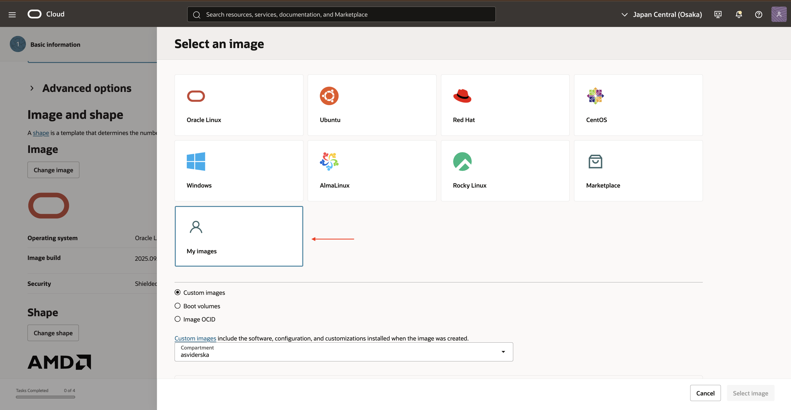

- **VM Shape**: Select **Image and shape** > **Change shape**

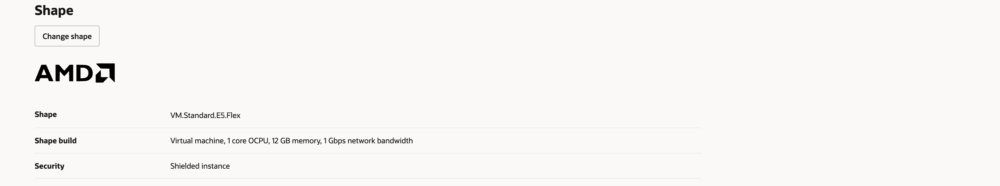

- Select the following Parameters:  
  **Instance type**: Virtual machine  
  **Shape series**: AMD  
  **Shape name**: VM.Standard.E5.Flex

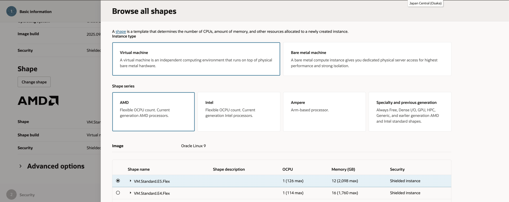


- **Network Settings (Primary VNIC information)**:
  - **Primary network** – Select **existing virtual cloud network** > Choose the **VCN created in Task 2**
  - **Subnet** – Select **existing subnet** > Choose the **Public Subnet created in Task 2**
  
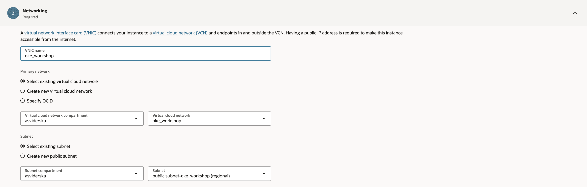

- **Note**: Validate the **Compartment name** if the VCN/Subnet is not visible in the drop-down list

  - **Primary VNIC IP addresses**:
    - **Private IPv4 address** → Checkbox: _Automatically assign private IPv4 address (default)_
    - **Public IPv4 address** → Checkbox: _Automatically assign public IPv4 address (default)_

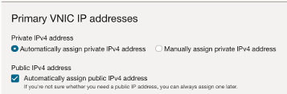

- **Add SSH Keys**:
    - Choose **Generate a key pair for me**  
    - Save both the **private** and **public** keys locally


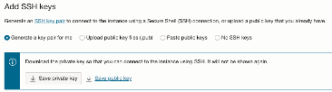

  
  - **Boot Volume**: Unchecked values (default)  
  - **Block Volume**: No volumes (default)  
  - **Live Migration**: Enabled (default)  
  - Click **Create** and validate the instance is in **Running** state  
  - Make a note of the **Public IP address**
  
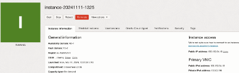


# 🧩 Task 6: Connect the VM via SSH

1. From terminal (On local computer – MacOS, Windows, Linux) enter the following command to change permission for the downloaded Private Key before SSH to the VM


```bash
chmod 700 ssh_private_key.key
```

1. From the terminal SSH to the VM by executing the following command:

```bash
ssh -i <path/to/private key/ssh_private_keyname> ubuntu@<PUBLIC_IP_OF_COMPUTE>
```


# 🧩 Task 7: Configure OCI CLI on VM

1. Execute the following command on the VM for OCI CLI setup:

```bash
oci setup config
```

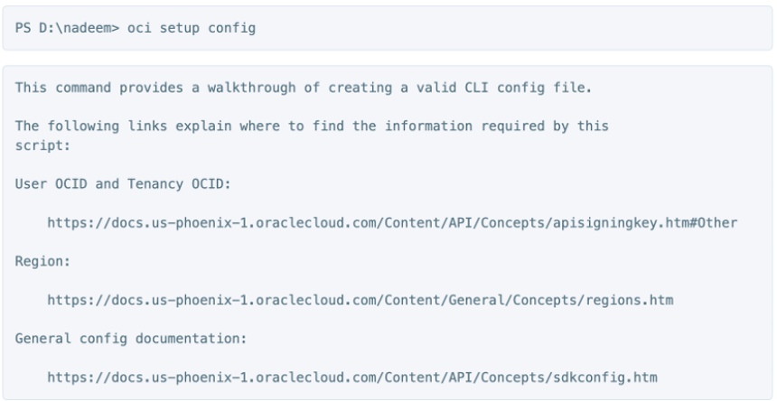

2. Choose default location > Click Enter


3. Enter User OCID when prompted.

4. Obtain the User OCID as follow:

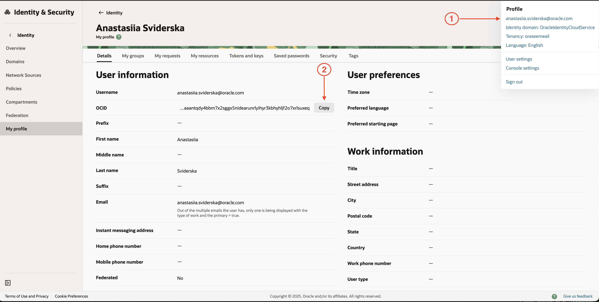

5. Enter Tenancy OCID when prompted.

6. Obtain the Tenancy OCID as follow:


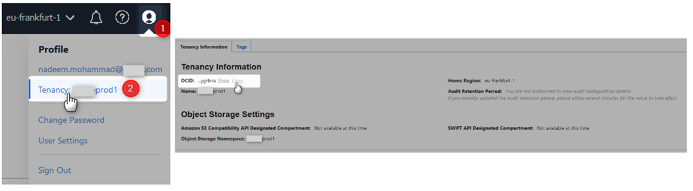

7. Enter Region when prompted: 27 (eu-frankfurt-1)

8. Generate API Keys as prompted:  
```bash
Do you want to generate a new RSA key pair? (If you decline you will be asked to supply the path to an existing key.) [Y/n]: Y  
Enter a directory for your keys to be created [\Users\nadeem\.oci]:  
Enter a name for your key [oci_api_key]:  
Public key written to: \.oci\oci_api_key_public.pem  
Enter a passphrase for your private key (empty for no passphrase): N/A  
Private key written to: \Users\nadeem\.oci\oci_api_key.pem  
Fingerprint: b2:04:c3:ee:22:d0:85:83:b6:fa:24:9e:93:2f:c5:27  
Config written to \Users\nadeem\.oci\config  
```

9. Copy public key  
- Execute the following command:

```bash
ubuntu@instance-vm-oke:~$ cd .oci/
ubuntu@instance-vm-oke:~/.oci$ ls
config  oci_api_key.pem  oci_api_key_public.pem
ubuntu@instance-vm-oke:~/.oci$ vi oci_api_key_public.pem
```

- Copy File: 

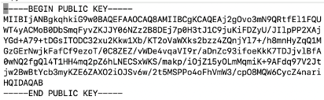

- Exit the file with command: 

```bash
:q
  
```

10. Upload Public key  
- In the OCI Console Navigate to **User Setting** > Click **API keys** > **Add API key**


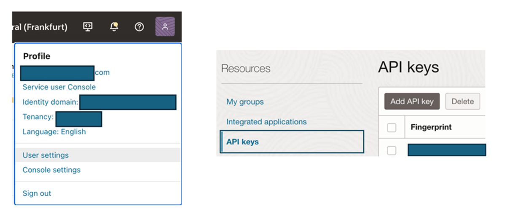

- Choose **Paste a public key** > Paste the public key copied earlier


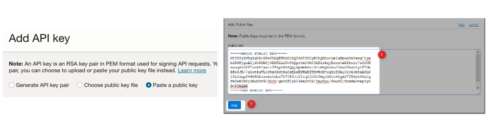

- Validate public key added


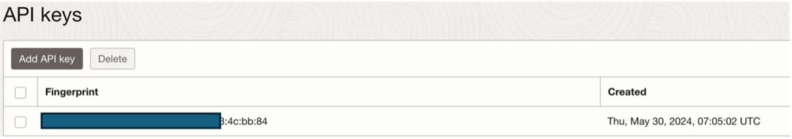

- Validate the OCI config file with the following command:

```bash
oci os ns get
```

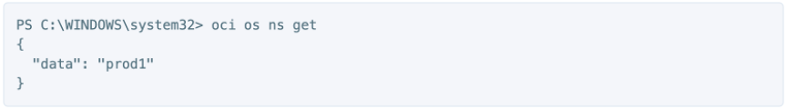

> **Note**: Wait few minutes for the Key to be updated before moving to Task 8


# 🧩 Task 8: Set Up Policy to Manage OCI Resources

1. Navigate to **Identity & Security > Domains** > Click **Default** > **Groups** > Click **Create Group** and add user to the group


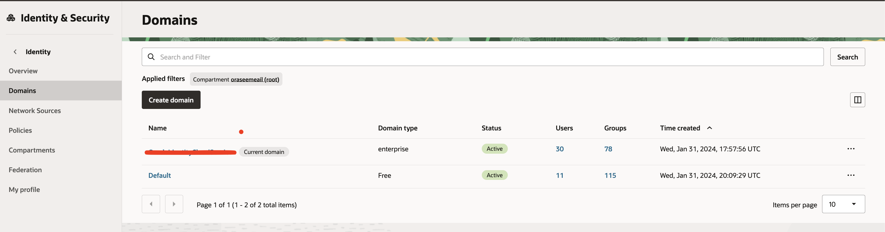

2. Create Group


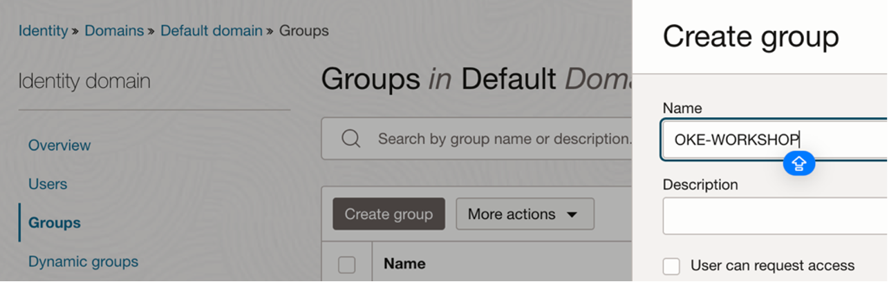

- Add the User to the Group via the **Create Group** tab:  
  Search **Username** > checkbox the username

  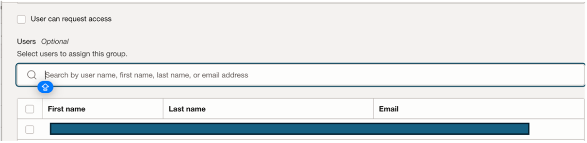

  3. Create Policy  
- Navigate to **Identity & Security > Domains > Policies > Create Policy**

- Add Policy:  
```text
Allow group <GroupName> to manage all-resources in tenancy <Tenancy Name>
```
> 🔧 **Change the view to:** Manual Builder

**Notes:**
- Replace `<GroupName>` with the newly created group  
- Replace `<CompartmentName>` with the root compartment name for the purpose of this lab  

⚠️ This policy is broad for simplicity, consider refining it for real-world usage.


# 🧩 Task 9: Running Containers Locally with Docker

## Introduction

This task demonstrates how to build microservices code on the created VM, push them to OCI Container Registry, and run them using Docker Compose.

---

### 1. Create Container Registry

- Navigate to **Developer Services > Container Registry**  
- Click **Create Repository**  
- Select the **root compartment**  
- Set **Access Type** to **Public**  
- Specify a **Repository Name**  
- Click **Create**


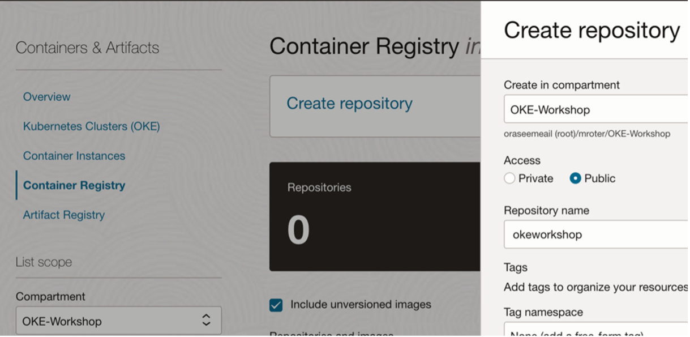

### 2. Generate Auth Token

- Click your **Profile icon** (top-right corner)  
- Go to **User Settings > Auth Tokens**  
- Generate a token and **copy it** for future use


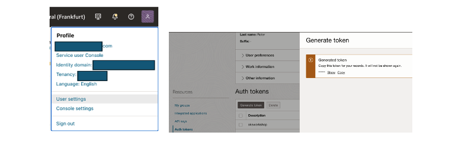


### 3. Staging Docker Images Locally

- Login to the repository using the following command:

```bash
docker login <region_code>.ocir.io
```

### 🔐 Docker Login – Frankfurt Region Example

- To log in to the OCI Container Registry for Frankfurt, use the following command:

```bash
docker login fra.ocir.io
```

**Username format:** `<registry-namespace>/default/<username>`  
**Example:** `froqjg8h9ftr/default/user@domain.com`  
**Password:** Use the Auth Token generated in your profile settings.


### 11. 🐳 Build and Deploy Using Docker

1. Create a folder called `oci_workshop`:

```bash
mkdir oci_workshop
cd oci_workshop
```

2. Clone the GitHub repository:
```bash
git clone https://github.com/oci-oke-workshop-il/oci-cloudnative-ext.git
```

3. Navigate to the src folder and validate that the following microservices exist.


### 4. 🛠️ Build Docker Images

- **Build Docker for the `api` microservice**:

```bash
docker build -t give_name_of_docker_image:version .

# Example:
docker build -t mushop_api:v1 .
```

- **Tag the newly created images as follow:**: 

```bash
docker tag give_name_of_docker_image:version oci_region/registry_namespace/registry_name/name_of_docker_image:version 

# Example: 
docker tag mushop_api:v1 fra.ocir.io/froqjg8h9ftr/oke_workshop/mushop_assets:v1
```
- **Push Docker images to the OCI container registry as follow**:

```bash
docker push oci_region/registry-namespace/registry_name/name_of_docker_image:version

# Example: 
docker push fra.ocir.io/froqjg8h9ftr/oke_workshop/mushop_api:v1
```

### 5. 🔁 Repeat for All Microservices

- **Repeat steps 4–6** for each image to ensure all microservices are uploaded.


### 6. ✅ Validate Docker Images

- **Run the following command** to verify all Docker images have been built:

```bash
docker images -a
```

