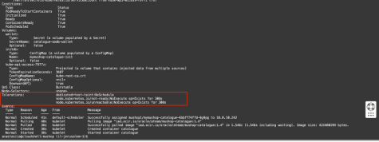

### LAB 10 – Use Taints and Tolerations for Resource Allocation (Optional) 

# What Are Taints and Tolerations in Kubernetes?
Taints and Tolerations are Kubernetes mechanisms used to control which pods can be scheduled on which nodes. They help with dedicated resource allocation, isolation, and workload placement.

# Taint:
A taint is applied to a node. It marks that node as unsuitable for general workloads unless a pod tolerates the taint.

>> For example:

```bash
kubectl taint nodes my-node dedicated=test-taint:NoSchedule
``` 
>> This means no pod will be scheduled on my-node unless the pod has a matching toleration.

# Toleration:
A toleration is applied to a pod. It tells Kubernetes that this pod can tolerate the specified taint on a node.

**In the pod YAML** :

```bash
tolerations:
  - key: "dedicated"
    value: "test-taint"
    effect: "NoSchedule"
``` 
>> This pod can now run on any node that has the matching taint dedicated=test-taint:NoSchedule.

# Use Case: If you want certain workloads (like production apps) to run only on specific high-performance nodes, use taints and tolerations to control their placement.

1. Open the following file:
```bash 
vi /XXX/deploy/complete/helm-chart/mushop/charts/catalogue/values.yaml
```
- Add the toleration parameters: 

```bash
tolerations:
  key: "dedicated"
  value: "test-taint"
   effect: "NoSchedule"
```

- Open the following file:
```bash
vi deploy/complete/helm-chart/mushop/charts/catalogue/templates/catalogue-deployment.yaml
```

Add the toleration parameters:
```bash

    {{- toYaml .Values.tolerations | nindent 8 }}
```
2. Redeploy the service and validate the following expected results:


