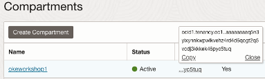
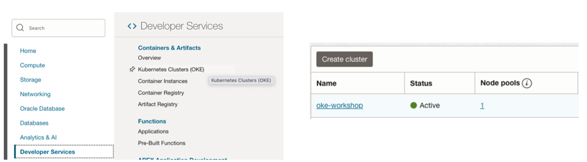

## LAB 2 – Deploy OKE Cluster with Terraform

###  Introduction

You will take on the persona of an **Operations Engineer**. You will initiate the Oracle Cloud environment that will be used to create and deploy your microservices applications.

This environment will be contained within a **cloud Compartment**, and communication within the Compartment will be via a **Virtual Cloud Network (VCN)**. The Compartment and VCN will isolate and secure the overall environment. You will deploy the **Oracle Cloud Infrastructure Container Engine for Kubernetes (OKE)**.


###  Task 1: Go to Terraform Directory

1. **Change directory** to the `Terraform-templates` folder within the cloned repository:

```bash
cd oci-cloudnative-ext/Terraform-templates
```

**Explanation**: The `cd` command navigates to the `Terraform-templates` directory where you will configure the deployment templates.

---

###  Task 2: Edit `terraform.tfvars`

1. 	Open `terraform.tfvars` using a text editor:

```bash
vi terraform.tfvars

```
**Explanation**: This file contains the variables required for your Terraform deployment. You need to modify it to specify details about your OCI environment.

2. Update **the following variables**:

```bash
compartment_id: This is the OCID of the compartment where you want to deploy your cluster.
region : Home region of the tenancy. 

#Example: 

compartment_id = ocid1.compartment.oc1..exampleuniqueID
region = "il-jerusalem-1"

```

**Explanation**: Replacing these variables with the correct OCIDs ensures that Terraform knows where to deploy your OKE cluster within your OCI environment.

3.	Obtain the `compartment_id` (OCID)

- Navigate to **Identity & Security > compartments**: 



---

###  Task 4: Apply Terraform Configuration to deploy OKE Cluster 

1. Initialize the directory with command: 

```bash

terraform init

```
**Explanation**: This command initializes your Terraform configuration by downloading the required plugins and preparing the environment.

2.	**Execute the Terraform plan command to preview changes**:

```bash

terraform plan

```
**Explanation**: This Task allows you to check for potential issues and confirm that the deployment configuration is correct.

3.	**Deploy the OKE cluster**:

```bash

terraform apply

```

**Explanation**: This command starts the deployment of the OKE cluster. Review the changes when prompted and type `yes` to confirm.

> ⚠️ **Note:** Terraform can take up to **15 minutes** to run, so it’s a great time to take a coffee break! 😊

---

###  Task 5: Validate Successful Deployment 

1.	Navigate to Developer Services > Kubernetes Clusters (OKE) > Click Cluster name > Review **cluster details** 




**Explanation**: Verifying in the OCI Console ensures that the cluster has been deployed as expected.