### 🔐 LAB 3 – OCI Vault Integration with OKE

####  Introduction
This lab outlines the required configuration steps to integrate the **OCI Vault** service with other **OCI services** (Oracle Autonomous Database).

---

### Task 1: Create a Dynamic Group for OKE Nodes

- Navigate to:  
  **Identity & Security > Domains > [Your Domain Name] > Dynamic Groups**

- This Dynamic Group will automatically include your **OKE cluster nodes**, enabling policy-based access to OCI resources.

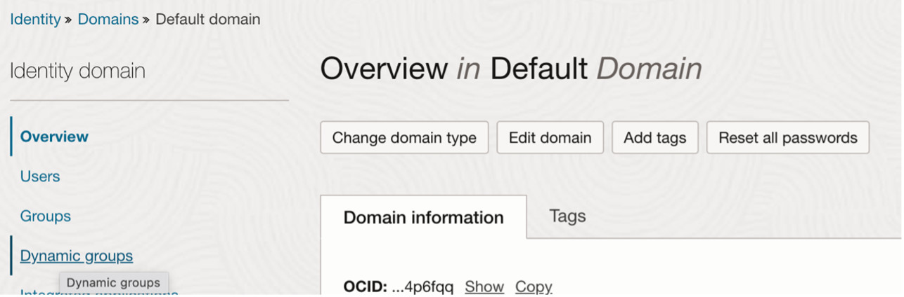

2.	Click **Create dynamic group** and fill the following information:
- Name :  `OKE-DG`
- Description : Include OKE nodes in the same group
- Matching rules > Rule 1 > add the following rule : 

```bash
ALL {instance.compartment.id = 'insert compartment ocid'}

```
> Example: 

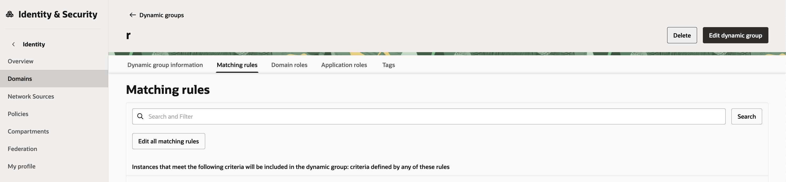
- Click **Create**

---

### Task 2: Create Policy to allow the OKE cluster access the Vault resource

1.	Navigate to **Identity & Security > Policies > Create Policy**

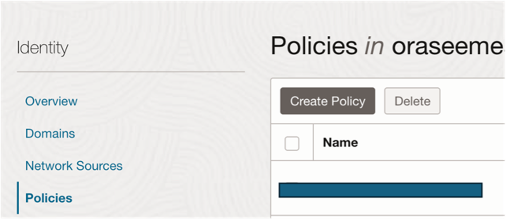

2.	Add Policies:

```bash

Allow dynamic-group <Dynamic-group-name> to read secret-bundles in compartment id <compartment-ocid>
Allow dynamic-group <Dynamic-group-name> to use keys in compartment id <compartment-ocid>
Allow dynamic-group <Dynamic-group-name> to manage secret-family in compartment id <compartment-ocid>

```
> **Notes**:  
Replace `<Dynamic-group-name>` with the newly created dynamic group and `<compartment-ocid>` with the root compartment ocid for the purpose of this lab.
If you have only Root compartment (tenancy) the syntax must be: 

```bash

Allow dynamic-group <Dynamic-group-name> to read secret-bundles in tenancy
Allow dynamic-group <Dynamic-group-name> to use keys in tenancy
Allow dynamic-group <Dynamic-group-name> to manage secret-family in tenancy

```
3.	Click **Create**

---

### Task 3: Install External Secrets Operator on OKE

1.	In OCI console Navigate to the **Developer Services > Kubernetes clusters (OKE)**.
2.	Choose the **OKE cluster** you have previously created with terraform. 
3.	Under Action tab in click on **Access cluster > Local Accsess** > Follow the instruction, please make sure that you execute the comands from the VM ( Please note you need to reffer only to PUBLIC ENDPOINT)

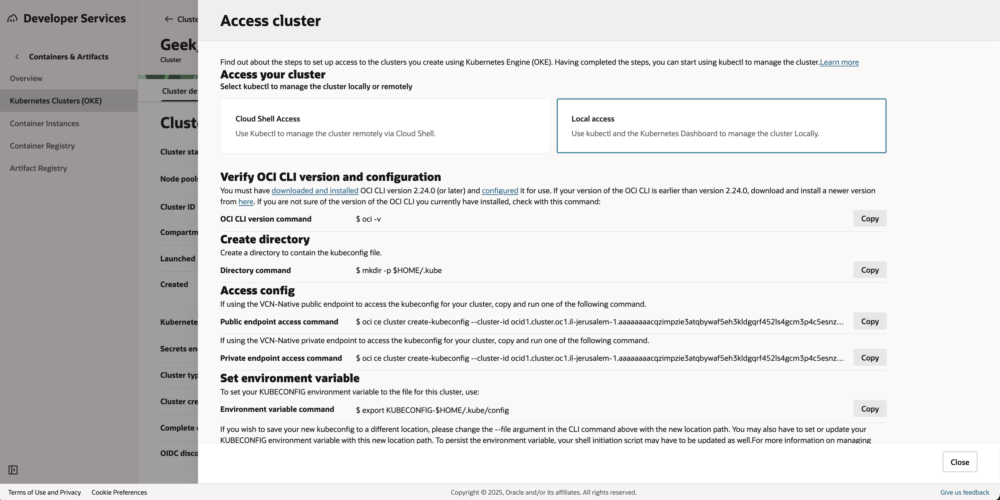

4.	**Execute the following commands in the VM Terminal**:

```bash

helm repo add external-secrets https://charts.external-secrets.io
helm install external-secrets \
  external-secrets/external-secrets \
  -n external-secrets \
  --create-namespace

```
---

### Task 4: Configuring ESO for use with OCI Vault

1.	Create a `oci-secret-store.yaml`:
- **Open editor in the VM terminal using VI command and create the following file**: 

```bash

apiVersion: external-secrets.io/v1
kind: SecretStore
metadata:
  name: workshop-vault
spec:
  provider:
    oracle:
      vault: <vault-OCID> #Replace <vault-OCID> with the Vault ocid created by the terraform
      region: eu-frankfurt-1 #Replace with your region

```

- **Execute the following command to deploy the yaml in the oke cluster**

```bash
kubectl create -f oci-secret-store.yaml
```
- **Validate that SecretStore resource created in the cluster**:

```bash
kubectl get secretstore -A
```

---

### Task 5: Create secrets in OCI Vault

1.	Navigate to **Identity & Security > Vault**

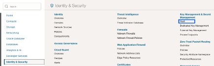

2.	Validate **compartment name (root)** and Click on the **Vault instance** created by terraform

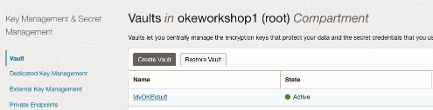

3.	Click **Secrets**

4.	Create the following secrets : `oadb-connection`,`oadb-wallet` & `oadb-admin`
      - Name: `oadb-admin`  
      - Compartment: `Use the root for the purpose of this lab`
      - Encryption Key: `Choose from drop-down list`
      - Secrets contents: **Challenge yourself here < place-your-adb-admin-password-from-terraform-code>**

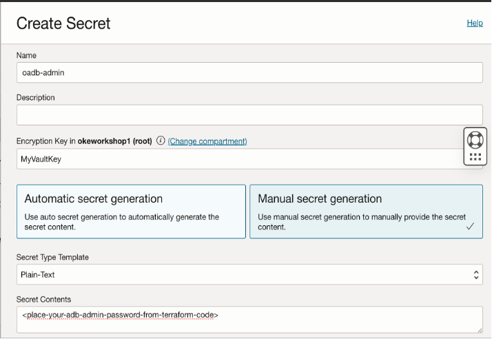

5.  Create oadb-connection secret as follow:
      - Name: `oadb-connection`
      - Compartment: `Use the root for the purpose of this lab`
      - Encryption Key: `Same as previous secret`
      - Secret Type Template: `< plain-text > `
      - Secrets contents: `Replace this value with the value of the adb-tnsname` **(refer to next section Obtain the adb-tnsname  to identify the value)**
      - Create secret: **Click CREATE SECRET when you finished to fill the information above**
      
Use the same value as before **oadb_wallet_pw** ( Same password from the Terraform ) and follow the guide where to find the **oadb_service**: 

-	Obtain the `adb-service`
      -  Duplicate the OCI portal window > Navigate to the **Search bar** and search for : Autonomous transaction

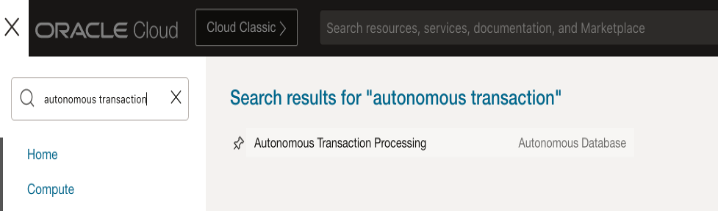

- Choose the **Databased created by the terraform** 

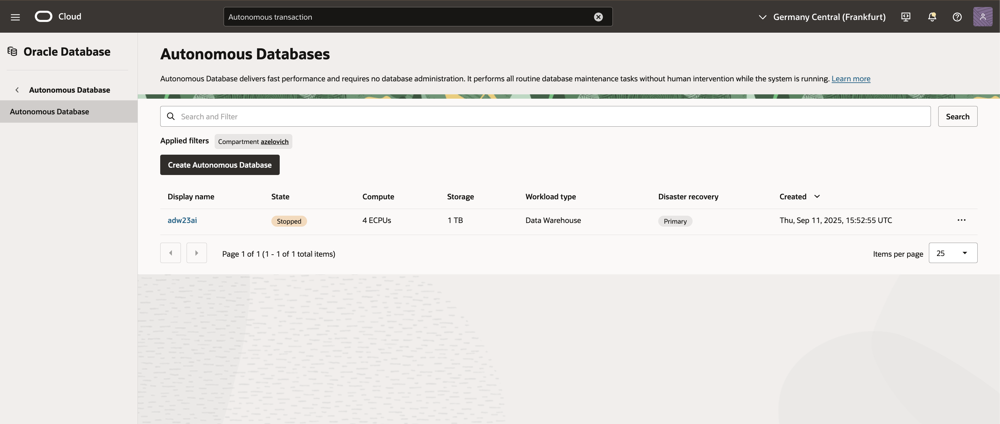

- Click on **DB connection**

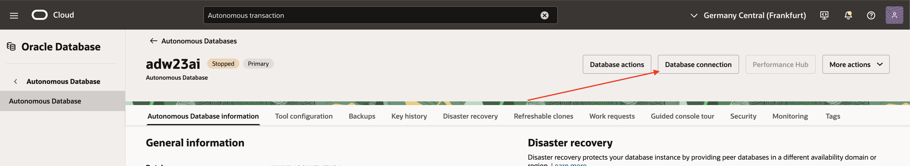

- In the Database connection view Scroll down to **Connection Strings** > Copy **TNS name_high** (Do not copy the connection string)

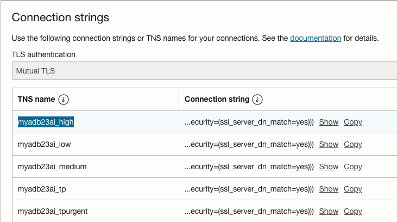

> **Do not close this window yet!**

- Go to previous **Section oadb-connection creation tab** and use the copied **TNS name** to fill the **Secret Type Template** and Finish the Tasks to create the `oadb-connection`
Please See the Example of the oadb-conncetion secret: 
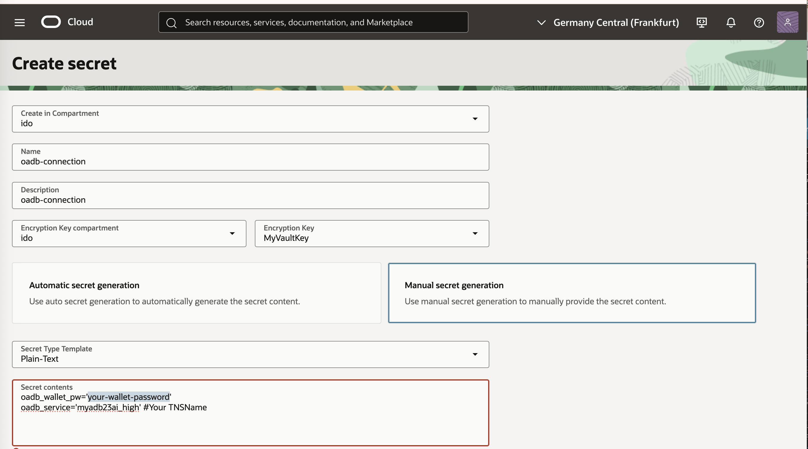

**Note** If you has been closed the section, you need to open the Vault that we created previusly and under the **Version** click on the lates secret, click on the 3 dots to view the secret content 

```bash
#Example 
oadb_wallet_pw=’your-wallet-password'
oadb_service='myadb23ai_high' #Your TNSName

```
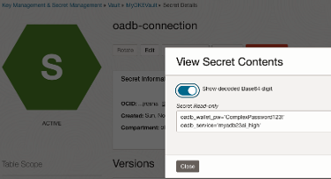

- Download **Client Credentials (Wallet)**
- Go back to **DB connection view page**
- Click **Download wallet**

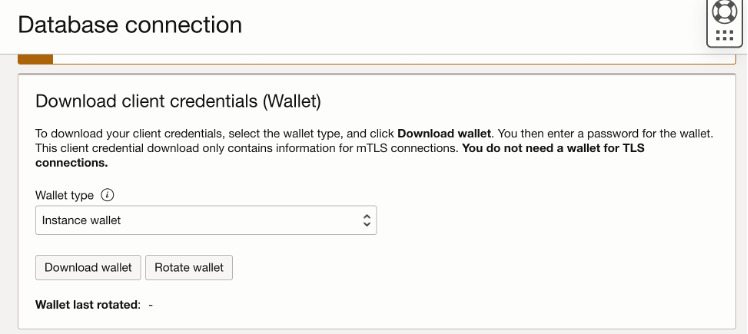

- Set Password and click **Download**

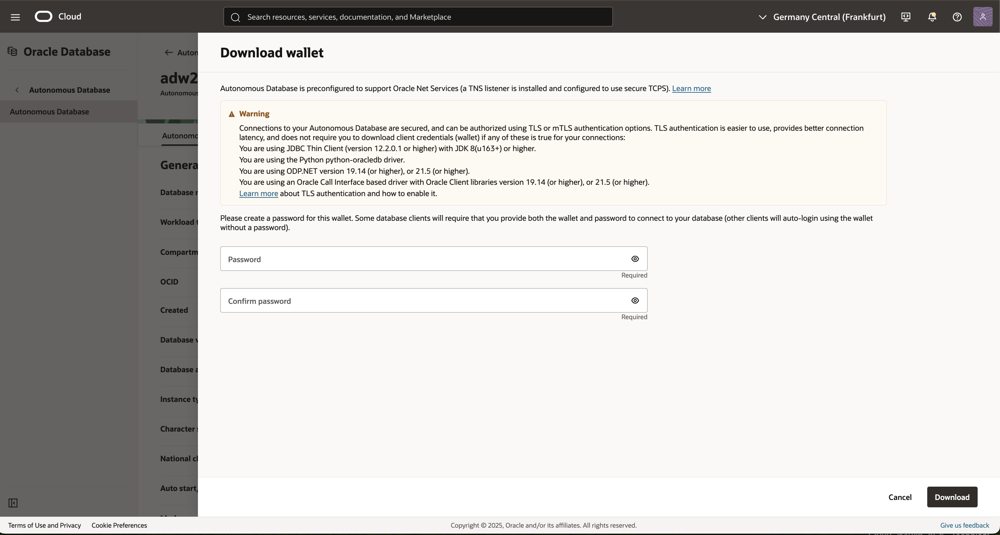

- Upload the file to the virtual machine In the OCI console Navigate to Storage > Buckets > click Create Bucket
     - Name: `my-bucket`
     - Default Storage Tier : `Standard`
     - Keep the default values for any additional values
     - Click **Create**

  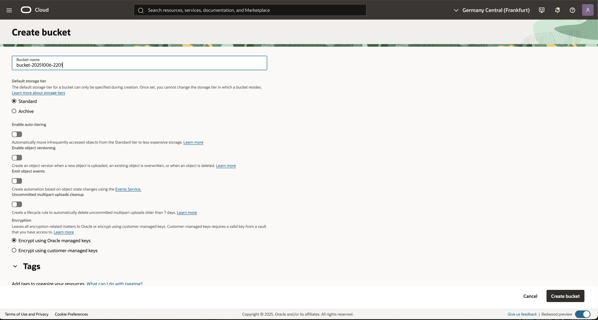   

- **Upload the Zip folder** to the bucket as describe in picture below : 

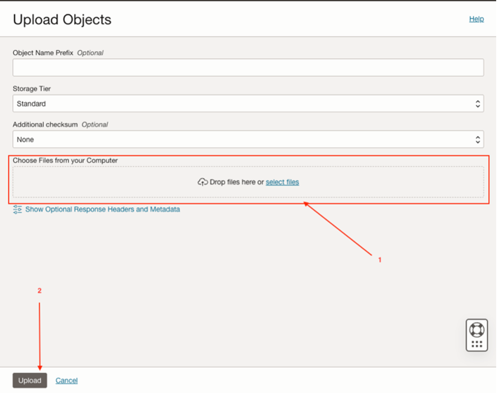


- **From the VM execute the following command**: 


```bash
oci os object bulk-download --bucket-name <BUCKET NAME> --download-dir <The DIR where you want to save the folder>

#Example:

oci os object bulk-download --bucket-name my-bucket --download-dir wallet-folder

```

- **Unzip** the folder locally from the VM with command:
```bash

unzip XXXX.zip

```

- Update the `oadb-wallet` file: **Copy the path of the directory where you save the unzipped files (execute the command pwd)**. 

- Create `oadb- wallet` secret as follow: 

      - Name: `oadb-wallet` 
      - Compartment: `Use the root for the purpose of this lab`
      - Encryption Key: `Choose from drop-down list`
      - Secret Type Template: `< plain-text > `
      - Secrets contents: **The path should be the value for the oadb-wallet secret.** For Example: /home/ubuntu


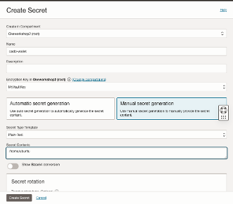


---

### Task 6: Create ExternalSecret

1.	Create file named `oadb-admin-secret.yaml` as follow: 

```bash

apiVersion: external-secrets.io/v1
kind: ExternalSecret
metadata:
  name: oci-secret-admin
spec:
  refreshInterval: 0.03m
  secretStoreRef:
    kind: SecretStore
    name: workshop-vault # Must match SecretStore name deployed on the cluster
  target:
    name: oadb-admin # Must match adb secret name downloaded in Task 4-section 9
    creationPolicy: Owner
  data:
  - secretKey: key
    remoteRef:
      key: oadb-admin


```

2.	Create file named `oadb-connection-secret.yaml` as follow: 

```bash

apiVersion: external-secrets.io/v1
kind: ExternalSecret
metadata:
  name: oci-secret-connection
spec:
  refreshInterval: 0.03m
  secretStoreRef:
    kind: SecretStore
    name: workshop-vault # Must match SecretStore name deployed on the cluster
  target:
    name: oadb-connection # Must match adb secret name downloaded in Task 4-section 9
    creationPolicy: Owner
  data:
  - secretKey: key
    remoteRef:
      key: oadb-connection

```

3.	Create file named `oadb-wallet-secret.yaml` as follow: 

```bash

apiVersion: external-secrets.io/v1
kind: ExternalSecret
metadata:
  name: oci-secret-wallet
spec:
  refreshInterval: 0.03m
  secretStoreRef:
    kind: SecretStore
    name: workshop-vault # Must match SecretStore name deployed on the cluster
  target:
    name: oadb-wallet # Must match adb secret name downloaded in Task4-section 9

    creationPolicy: Owner
  data:
  - secretKey: key
    remoteRef:
      key: oadb-wallet

```

4.	**Deploy Secrets Yaml files by executing the following commands**:

```bash
kubectl apply -f oadb-admin-secret.yaml
kubectl apply -f oadb-connection-secret.yaml
kubectl apply -f oadb-wallet-secret.yaml
```


---

### Task 7: Validate external secrets created 

1.	Execute the following commands:

```bash
kubectl get es -A
```


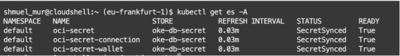

```bash
kubectl get secrets 

# validate that secrets created and sync with vault
```

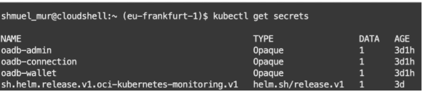


```bash
sudo apt update
sudo apt install -y jq
kubectl get secret oadb-wallet -o json | jq -r ."data.key" | base64 -d


# validate secrets in OKE synced with value
```

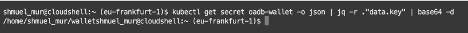

