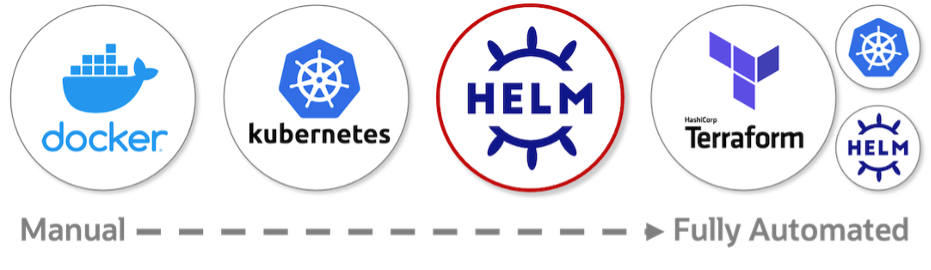
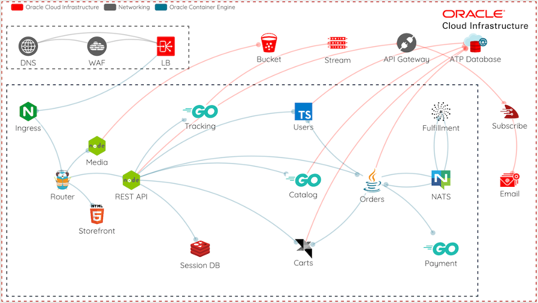
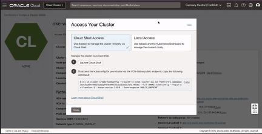
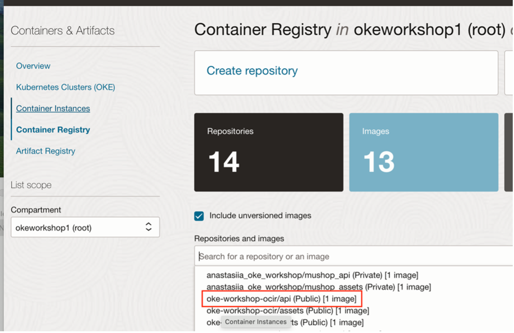
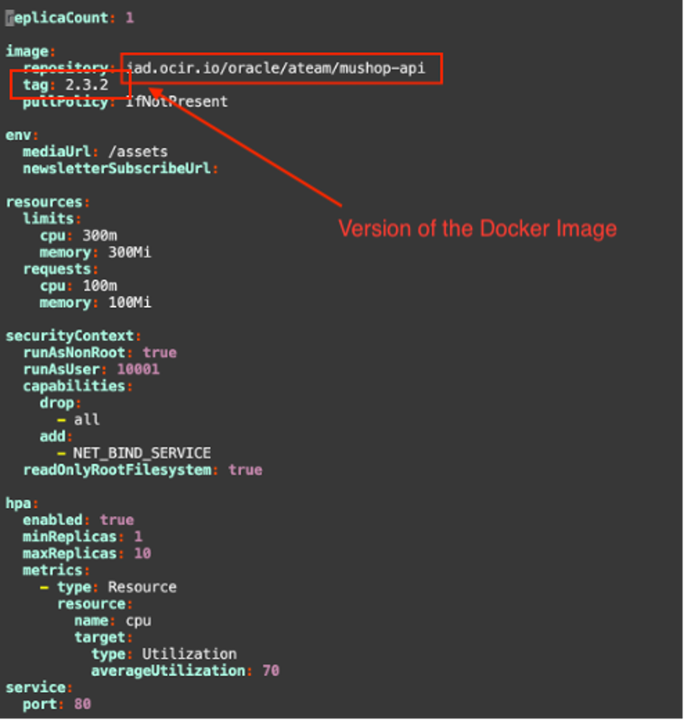
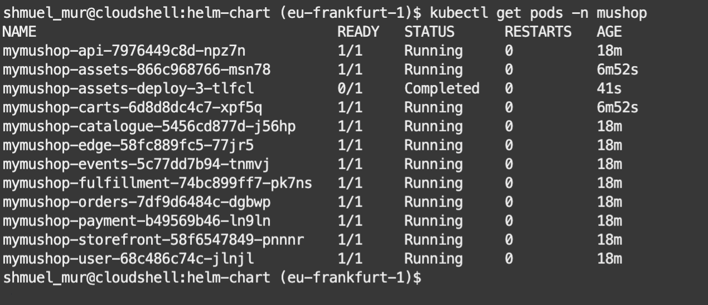

###  LAB 4 – Install MuShop Using Helm

#### Introduction

There are four options for deploying **MuShop**.  
They range from **manual (Docker)** to **automated (Helm)** and **fully automated (Terraform)**.



Designing in microservices offers excellent separation concerns and provides developer independence. While these benefits are clear, they can often introduce some complexity for the development environment. Services support configurations that offer flexibility, when necessary, and establish parity as much as possible. It is essential to use the same tools for development to production.



> Note: This diagram contains services not covered by these labs.

---

### Task 1: Access the OKE Cluster from Cloud Shell

1.	In OCI console Navigate to the Developer Services > **Kubernetes clusters (OKE)**.
2.	Choose the OKE cluster you have previously created with terraform. 
3.	Connect to the OKE cluster from Quick Start with Cloud Shell. 



---

### Task 2: Obtain MuShop source code

1.	Open Cloud Shell and clone the github repo.

```bash
git clone https://github.com/oci-oke-workshop-il/oci-cloudnative-internal.git

```
2.	Change to the mushop directory containing the Helm charts:

```bash
cd oci-cloudnative-internal/deploy/complete/helm-chart/mushop/charts

```

---

### Task 3: Update the Image Repository

In this Task we will Update the image repository in the `values.yaml` files for the following microservices -  **API, Storefront & Catalogue** . 

The new value must point to the container repository previously created in **Lab 1**

1.	Enter every folder in `helm-chart/mushop/charts` , For example  `/api`.
2.	Open the `values.yaml` file.
3.	Update the `image.repository` field with the full path of the container repository created previously.
4.	Update the Tag for the image that you pushed previusly, For example v1



> Example (`values.yaml` for one of the microservices):



5.	Repeat this process for **API**, **Storefront** & **Catalogue microservices**!!!

---

### Task 4: Deploy the eCommerce App with Helm

1.	Deploy the application by Executing the following command from path **~/USERNAME/oci-cloudnative-internal/deploy/complete/helm-chart** :
```bash
helm install mymushop mushop \
  --namespace mushop \
  --create-namespace \
  --set global.mock.service=all

```
> **Please be patient**. It may take a few moments to download all the application images.


2. Execute the following command:

```bash
kubectl get pods -n mushop
```
 
 > Sample response to make sure all the pods are EXISTS and in the **Running** state

 


 


