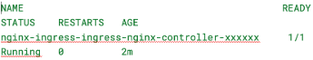

### 🧪 LAB 5 - Install Ingress Controller 

#### Prerequisites : Running Kubernetes cluster , kubectl , Helm installed.

#### 📘 What is an Ingress?

In Kubernetes, an **Ingress** is an API object that manages external access to the services within a cluster, typically HTTP or HTTPS.  
It allows you to define **rules for routing traffic** to different services based on the request path or host.

Instead of exposing each service with a separate LoadBalancer or NodePort, you can define a single Ingress that handles routing.

#### 🌐 What is NGINX Ingress Controller?

**NGINX** is a popular open-source web server that can also be used as a reverse proxy, load balancer, and HTTP cache.  
The **NGINX Ingress Controller** is a Kubernetes-native implementation that uses NGINX to manage the Ingress rules.

It listens for changes to Ingress resources and automatically configures NGINX to serve traffic accordingly.  
This allows users to **securely and efficiently route external requests** to the appropriate Kubernetes services.

---

### Task 1: Add NGINX Ingress Helm Repository

- Execute the following command:
```bash

helm repo add ingress-nginx https://kubernetes.github.io/ingress-nginx
helm repo update
```

---

### Task 2: Create a namespace for NGINX Ingress

- Execute the following command:

```bash

kubectl create namespace nginx-ingress
```

---

### Task 3: Install NGINX Ingress Controller using Helm

- Execute the following command:

```bash
helm install nginx-ingress ingress-nginx/ingress-nginx --namespace nginx-ingress

```

---

### Task 4: Validate installation

- Execute the following command:
```bash

kubectl get pods -n nginx-ingress

```

> Sample Result: 



