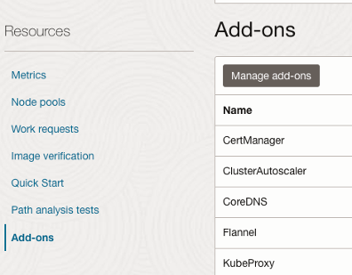
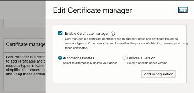
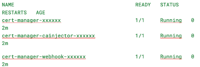
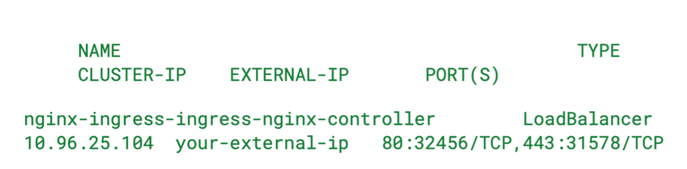
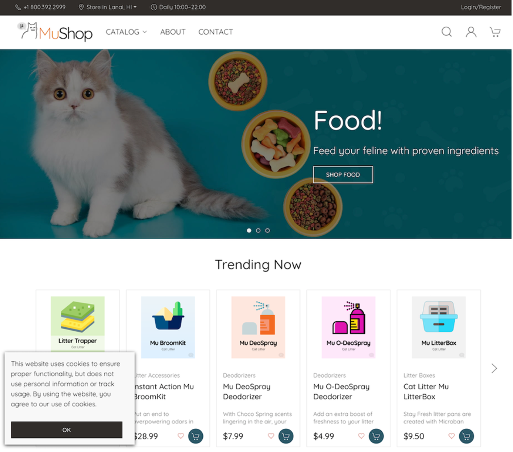

### 🔒 LAB 6 – Install CertManager


#### 📘 What is CertManager?

**CertManager** is a native Kubernetes add-on that helps manage SSL/TLS certificates inside your Kubernetes cluster.  
It automates the issuance, renewal, and management of certificates from various sources.


---

#### OCI Native CertManager Add-On for OKE

Oracle Cloud Infrastructure provides a **native CertManager add-on** as part of the **OKE (Oracle Kubernetes Engine)** offering.  
This add-on integrates seamlessly with OCI’s services and automates the installation and lifecycle of CertManager components within your cluster.

✅ **Benefits:**

- Easy one-click deployment via the OKE Console
- Managed and monitored by Oracle
- Simplifies certificate issuance and renewal for Kubernetes services

You can use this add-on to configure **Let's Encrypt**, OCI Vault, or external CA-based certificate management with minimal setup.

> ⚠️ **Tip:** After installing CertManager, you can deploy a `ClusterIssuer` or `Issuer` resource to start issuing certificates automatically.

---

####  Task 1: Add Cert-Manager to OKE via Add-on

1. Navigate to **Developer Services > OKE** >> Click on your **Cluster Name** >> Go to the **Add-ons** tab >> Click **Manage add-ons** >> Select **CertManager** and install it



---

####  Task 2: Enable CertManager 




---

####  Task 3: Validate CertManager installation  

- Verify that CertManager pods are running with command: 

```bash
kubectl get pods -n cert-manager

```
> Sample response  



---

####  Task 4: Create Let's Encrypt ClusterIssuer 

1.	Create a YAML file named : `letsencrypt-prod-clusterissuer.yaml`

```bash
vi letsencrypt-prod-clusterissuer.yaml

```


2.	Enter the following: 

```bash
apiVersion: cert-manager.io/v1
kind: ClusterIssuer
metadata:
  name: letsencrypt-prod
spec:
  acme:
    server: https://acme-v02.api.letsencrypt.org/directory
    email: your-email@example.com # Replace with your email
    privateKeySecretRef:
      name: letsencrypt-prod
    solvers:
    - http01:
        ingress:
          class: nginx

```
---

####  Task 5:  Apply the ClusterIssuer:

```bash
kubectl apply -f letsencrypt-prod-clusterissuer.yaml
```


---

####  Task 6: Validate  ClusterIssuer created:

```bash
kubectl get clusterissuer
```

> Sample response
```bash
NAME                READY   AGE
letsencrypt-prod    True    2m
```

---

#### Task 7: Configure the MuShop Ingress Resource with TLS

1.	Create YAML file named: `mushop-dev-ingress.yaml`
```bash
vi mushop-dev-ingress.yaml
```

2.	Add the following content:
```bash
apiVersion: networking.k8s.io/v1
kind: Ingress
metadata:
  name: mushop-dev
  namespace: mushop  
  annotations:
    kubernetes.io/ingress.class: nginx
    cert-manager.io/cluster-issuer: letsencrypt-prod
spec:
  tls:
  - secretName: tls-secret
  rules:
  - http:
      paths:
      - path: /
        pathType: Prefix
        backend:
          service:
            name: edge
            port:
              number: 8080
```

---

####  Task 8: Apply the Ingress Resource:

1.	Apply the Ingress resource to your mushop namespace:
```bash

kubectl apply -f mushop-dev-ingress.yaml
```


---

#### Task 9: Validate Ingress Setup:

- Execute the following command:
```bash
kubectl get ingress mushop-dev -n mushop
```

> Expected results after LoadBalancer deployment:
     -   Ingress resource and an external IP
     -   Hostname

---

#### Task 10: Test HTTPs Access:

1.	Find the External IP assigned to the ingress controller. 
```bash
kubectl get svc -n nginx-ingress
```

**Look for the EXTERNAL-IP in the output:** 

> Sample response



---

#### Task 11: Application Access:

1.	Open to the MuShop Storefront by using your browser connecting to `https://< EXTERNAL-IP >`




