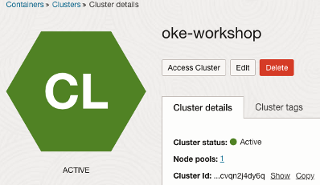
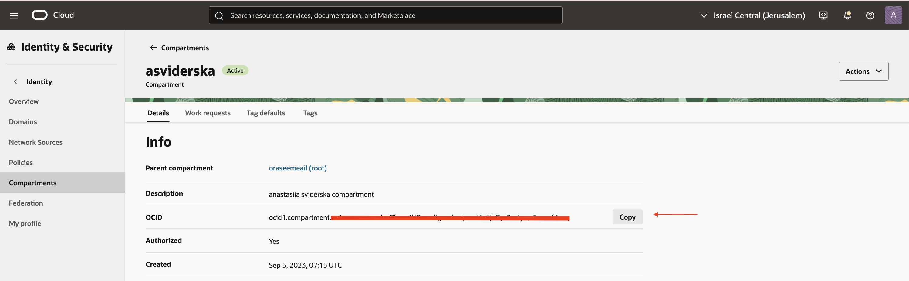
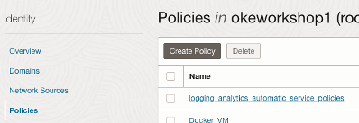
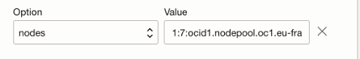
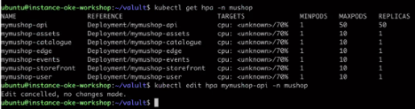
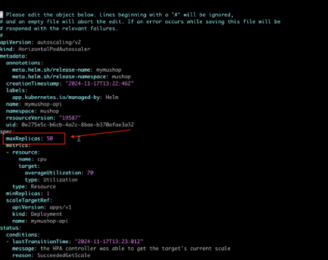
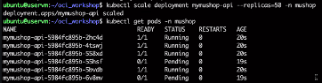
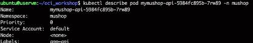
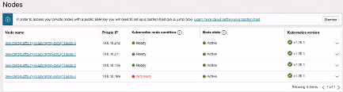

### 📈 LAB 7 – Deployment Autoscaling

#### Introduction

Scaling out a **Deployment** ensures new Pods are created and scheduled on Nodes with available resources.  
Scaling will increase the number of Pods to the desired state.


> ℹ️ While Pod autoscaling is beyond the scope of this specific tutorial, this step highlights how **Horizontal Pod Autoscaling** is configured in the **MuShop** application deployment.

---

#### Task 1: Create Policy to Work with Autoscaler

To allow the **Cluster Autoscaler Add-on** to manage node pool resources, you need to set up an **Instance Principal** and IAM policies.

1. **Obtain the Cluster OCID (Cluster ID)**  
   - This will be required when configuring IAM policies or using Terraform.

   

- Obtain Compartment OCID - **Navigate to Identity & Security**  > compartments 
  

2.	Create the policy 

- **Navigate to Identity & Security > Policies > Create Policy**

  

- Fill the policy name  `cluster-autoscaler-policy`
   > Enter policy statements to allow node pool management as follow:

```bash

   Allow dynamic-group <dynamic-group-name> to manage cluster-node-pools in compartment id <compartment-ocid> where ALL {request.principal.type='workload', request.principal.namespace ='kube-system', request.principal.service_account = 'cluster-autoscaler', request.principal.cluster_id = '<cluster-ocid>'}

   Allow dynamic-group <dynamic-group-name> to use subnets in compartment id <compartment-ocid> where ALL {request.principal.type='workload', request.principal.namespace ='kube-system', request.principal.service_account = 'cluster-autoscaler', request.principal.cluster_id = '<cluster-ocid>'}

   Allow dynamic-group <dynamic-group-name> to read virtual-network-family in compartment id <compartment-ocid> where ALL {request.principal.type='workload', request.principal.namespace ='kube-system', request.principal.service_account = 'cluster-autoscaler', request.principal.cluster_id = '<cluster-ocid>'}

    Allow dynamic-group <dynamic-group-name> to use vnics in compartment id <compartment-ocid> where ALL {request.principal.type='workload', request.principal.namespace ='kube-system', request.principal.service_account = 'cluster-autoscaler', request.principal.cluster_id = '<cluster-ocid>'}

    Allow dynamic-group <dynamic-group-name> to inspect compartments in compartment id <compartment-ocid> where ALL {request.principal.type='workload', request.principal.namespace ='kube-system', request.principal.service_account = 'cluster-autoscaler', request.principal.cluster_id = '<cluster-ocid>'}

    Allow dynamic-group <dynamic-group-name> to manage all-resources in tenancy

```

>> **Replace**:
-	`<cluster-ocid>` with the cluster OCID obtained previously.
-	`<compartment-ocid>` with the cluster OCID obtained previously.
-	`<dynamic-group-name>` with the Dymanic group created on **LAB 3 (Vault)**


---

#### Task 2: Create the Cluster Autoscaler Add-on configuration

1.	In OCI console navigate to **OKE cluster > Add-on > Manage Add-ons > Click on Cluster Autoscaler > Click “Enable Cluster** Autoscaler > Choose nodes from the option drop-down list > Fill the “Value” parameters
- The nodes parameter value has the following format:



2.	For this lab Replace :
   - `<min-nodes>` = 1 , The minimum number of nodes allowed in the node pool. The Kubernetes Cluster Autoscaler will not reduce the number of nodes below this number.
   - `<max-nodes>` = 5 , The maximum number of nodes allowed in the node pool. The Kubernetes Cluster Autoscaler will not increase the number of nodes above this number. Make sure the maximum number of nodes you specify does not exceed the tenancy limits for the worker node shape defined for the node pool.
o	<nodepool-ocid> with the node pool OCIDs.

---

#### Task 4: Change the Value of the HPA autoscaaller: 

1.	Execute the command:
```bash
kubectl get hpa –n mushop
```

2.	Edit the value of the HPA with the command : 
```bash
kubectl edit hpa mymushop-api -n mushop
```


3.	Change the value to **50**: 



4.	Save the changed with command: 
```bash
:wq
```

---

#### Task 5: Increase replica count in the Mushop API service deployment to 50

1.	Execute the following command:
```bash
kubectl scale deployment mymushop-api --replicas=50 -n mushop
```

> Example – Status should be **“Running”** for all 




2.	Where Pod Status is **“Pending”** you might verify the reseaon by executing the following command :
```bash
kubectl describe pod <add pod name>  -n mushop
```
> Example – Status should be **“Running”** for all 




---

#### Task 6: Validate replica size and new node were created in the nodepool
1.	In the CLI  Execute the following command:
```bash
kubectl get pods -n mushop
```

2.	In OCI console navigate to **Developer services > Kubernetes Clusters (OKE) > click Cluster Name > click Node pools > click Node pool name > validate the number of Nodes > 3**



---

#### Task 7: Revert replica size 
1.	Execute the following command and validate that pods are **terminated**
```bash

kubectl scale deployment mymushop-api --replicas=1 -n mushop
```

2.	Validate the number of nodes in the OCI console as described in task 6.

---

#### Task 8: validate # pod revert to the original count
```bash

kubectl get pods -n mushop

 ```
