### 📊 LAB 8 – Monitoring the Deployment

####  Introduction

**Observability** is key to understanding the state and behavior of your systems. It combines:

- **Logs** – Record events and outputs
- **Metrics** – Measure system health and performance
- **Traces** – Track requests across services

Together, these provide deep visibility into your deployment and help with proactive troubleshooting and optimization.

> ✅ **Pre-requisites**: Ensure **OCI CLI** and **Kubectl** are installed and configured.

---

####  Task 1: OKE Management Pack Deployment

1. Navigate to **Observability & Management > Logging Analytics**
2. Click on **Solutions** to begin the OKE monitoring integration process.

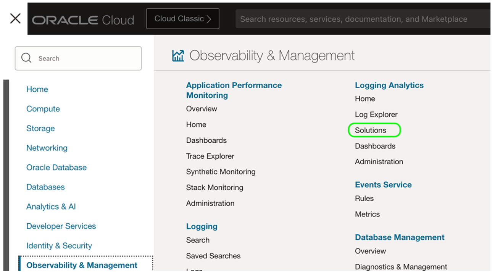

3. Choose Kubernetes solution: 

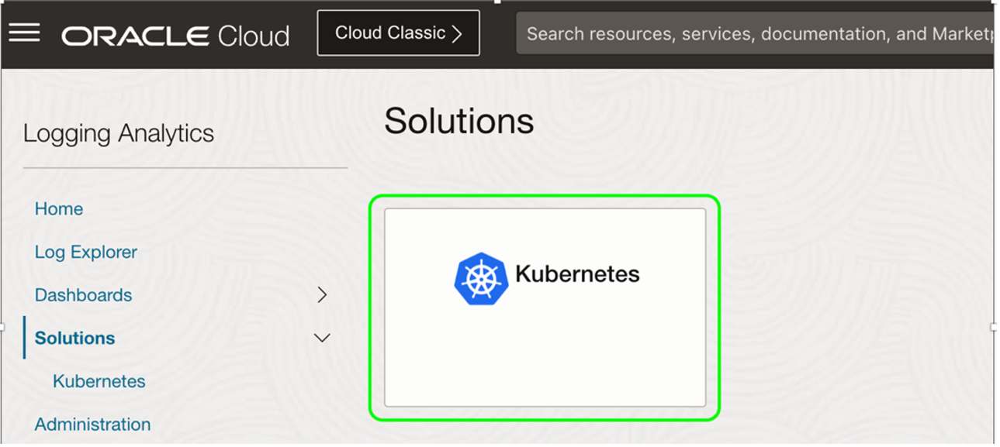

4. Click on Connect clusters

 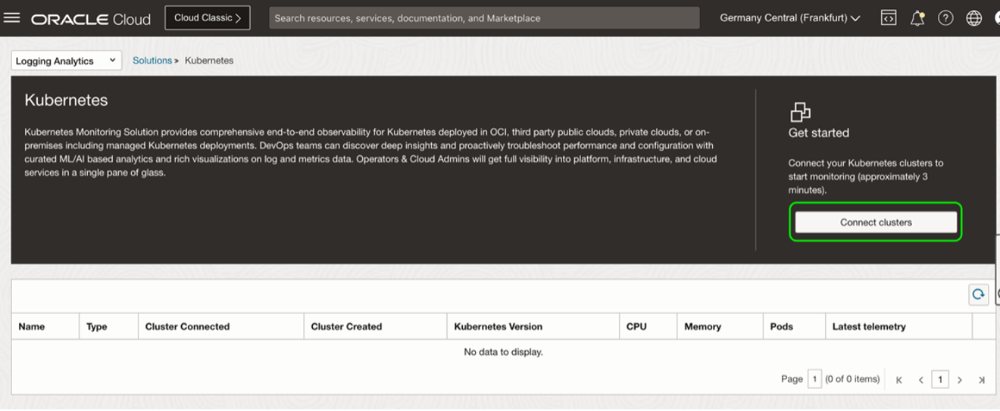

5.  Add Data > Monitor Kubernetes > Oracle OKE

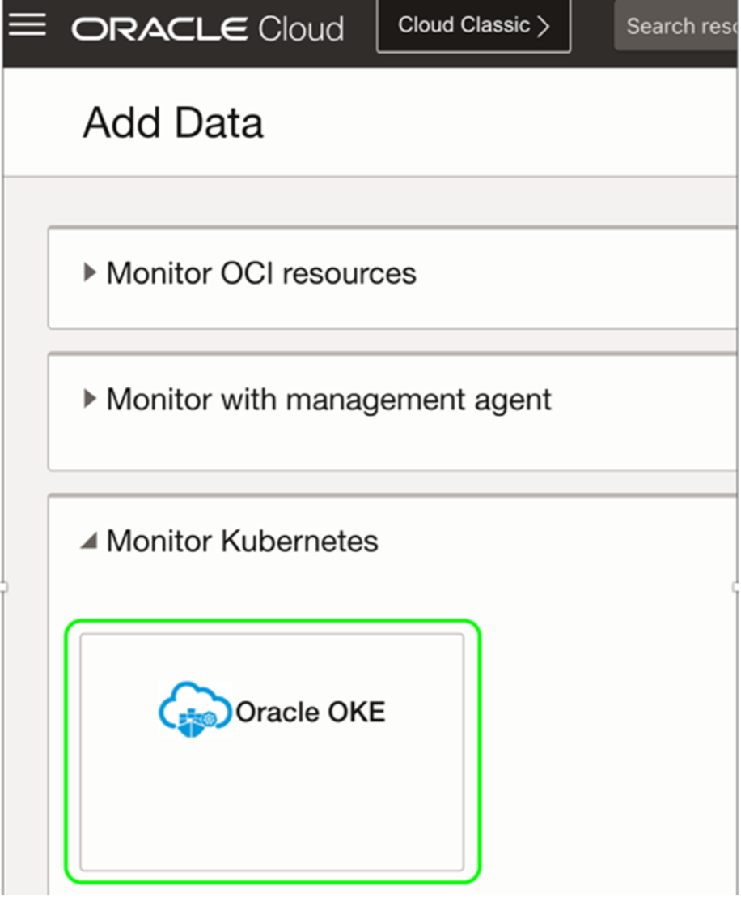

6. 	Select the OKE cluster from the clusters list and click Next: 

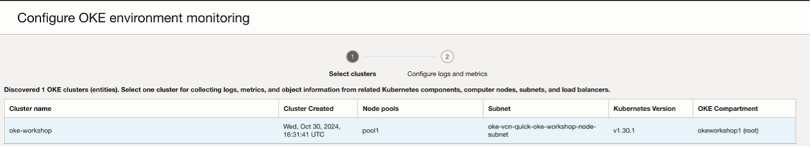

7. Validate all the details based on the following screen: 

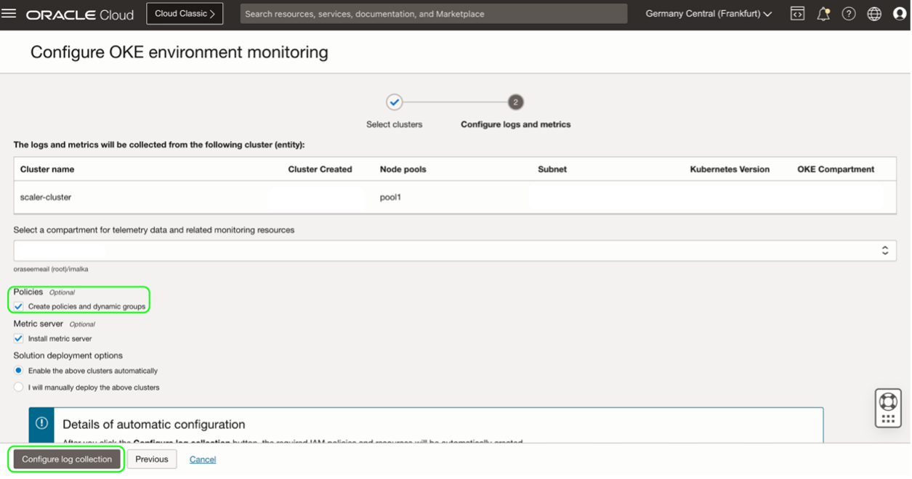

8. 	The following page after assure that OKE monitoring environment configured succefuly 

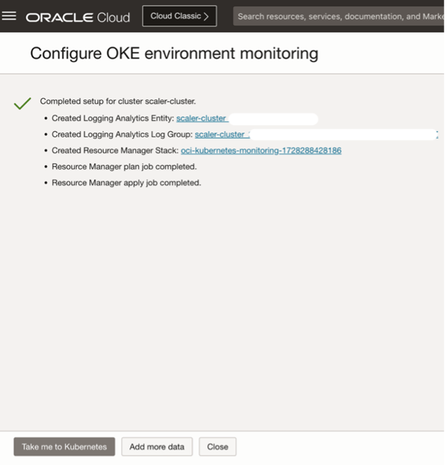

9.	Validate OKE components deployed successfully via CLI
```bash
kubectl get pods -n oci-onm
```

> Sample response: 

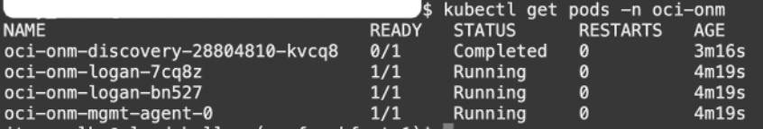

---

#### Task 2: Create (import) OKE Dashboards

1.	Go into the cloned GitHub repository ‘oci-cloudnative-ext’ or clone it again as follow :
```bash

git clone https://github.com/oci-oke-workshop-il/oci-cloudnative-ext.git
```

2.	Execute the following commad
```bash

cd oci- cloudnative-ext/dashboards_json
```

3.	Obtain  the OCID of the compartment, where the dashboards need to be imported (same as the OKE cluster’s compartment).
```bash
${compartment_ocid} - Replace all the instances of the keyword in the JSON with Compartment OCID
```

4.	The Following command is for quick reference that can be used in a linux/cloud-shell environment:
```bash
sed -i "s/\${compartment_ocid}/<Replace-with-Compartment-OCID>/g" *.json
```
5.	Execute the following commands to import the dashboards.
```bash
        oci management-dashboard dashboard import --from-json file://cluster.json
        oci management-dashboard dashboard import --from-json file://node.json
        oci management-dashboard dashboard import --from-json file://workload.json
        oci management-dashboard dashboard import --from-json file://pod.json
        oci management-dashboard dashboard import --from-json file://service-type-lb.json
```


---

#### Task 3: Review the OKE Dashboard

1.	Navigate to **Observability & Management > Logging Analytics > Click on Dashboards**

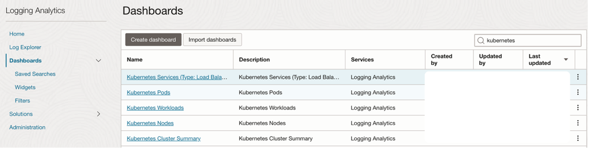

2.	Click on the dashboards to view the **cluster metrics, logs and status**:

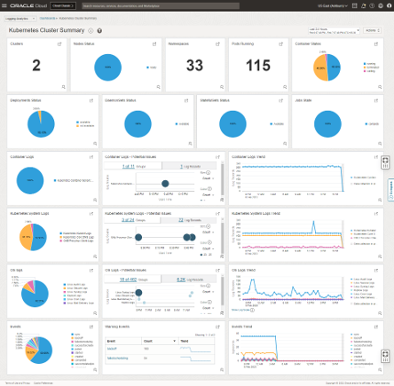


---

#### Task 3: Review OKE Metrics

1.	OKE Cluster Metrics: **Navigate to Developer Services > Kubernetes Clusters >**
2. Under Resources -> Metrics observe the following metrics:
        - Unschedulable pods, which can be used to trigger node pool scale operations when there are insufficient resources on which to schedule pods.
        - API Server requests per second, which is helpful to understand any underlying performance issues seen in the Kubernetes API server.
3.	These metrics can also be viewed from OCI Monitoring console under `oci_oke` namespace. Additionally, alarms can be created using industry standard statistics, trigger operators, and time intervals.

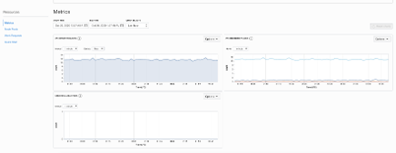

4.	OKE Node Pool Metrics: Navigate to Developer Services > Kubernetes Clusters > Node Pools >

Observe the following node pool metrics:
       - Node State (If your worker nodes are in Active state as indicated by OCI Compute Service)
       - Node condition (If your worker node are in Ready state as indicated by OKE API server)

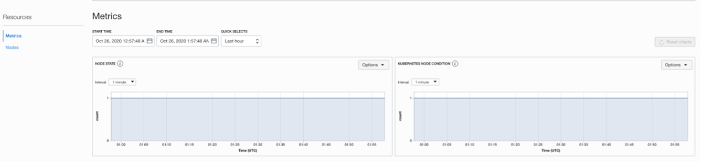

5.	OKE Worker Node Metrics: Navigate to Developer Services > Kubernetes Clusters >  Node Pools > Nodes > 
Observe the following node metrics:
      - Activity level from CPU. Expressed as a percentage of total time (busy and idle) versus idle time. A typical alarm threshold is 90 percent.
      - Space currently in use. Measured by pages. Expressed as a percentage of used pages versus unused pages. A typical alarm threshold is 85 percent.
      - Activity level from I/O reads and writes. Expressed as reads/writes per second.
      - Read/Write throughput. Expressed as bytes read/Write per second.
      - Network receipt/transmit throughput. Expressed as bytes received/transmit per second.

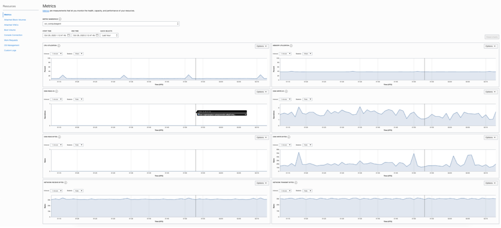

