###  LAB 9 – Create Alarms to Detect Unscheduled Pods

---

####  Task 1: Create an OCI Topic & Subscription for Email Notifications

1. Go to the **OCI Console** >> Search for **Notifications**

- Click on **Notifications** under the **Application Integration** section
- Create a **Topic** to handle alarm communications
- Add a **Subscription** using your email address to receive alerts

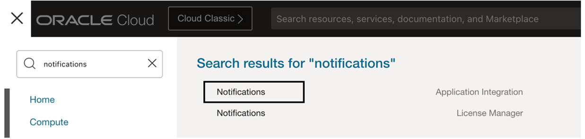

2.	Click Create topic and name it – **EmailsTopic** 

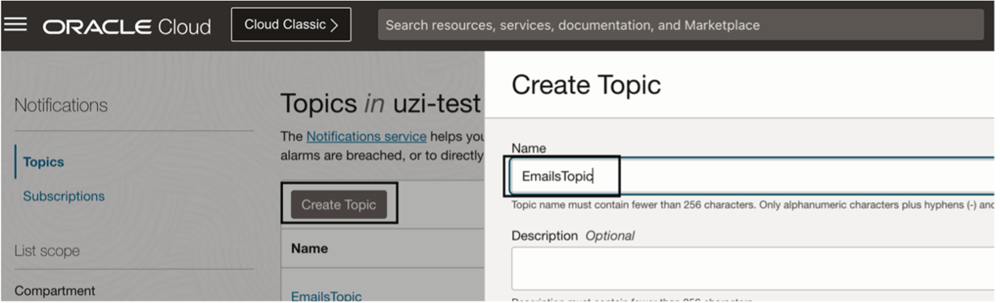

3.	Click on the created **topic > Select Create Subscription > Protocol Email > Email {Your-Email-Address} > Click Create**

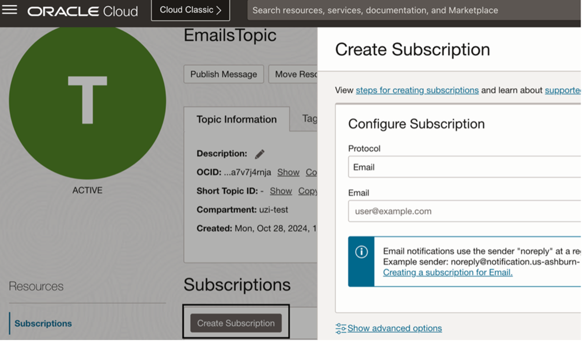

4.	Go to your email inbox > Confirm the subscription.

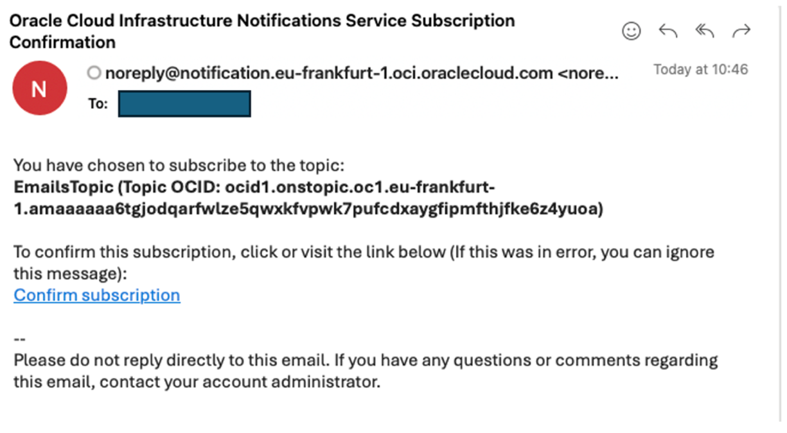

5.	Validate Created Subscription in Active state

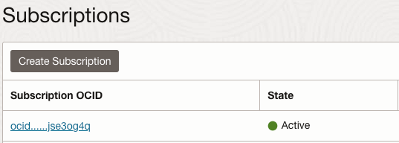

---

#### Task 2: Configure Alarm rule

 # The following alarm will generate a notification when the number of Kubernetes Nodes will be less than 3 Nodes which indicates a non-stable environment!

1.	Search for Alarm > click of Alarm Definitions under Monitoring

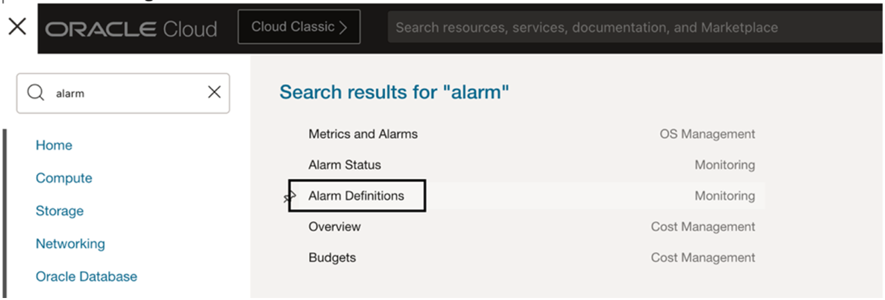

2.	Click Create Alarm: 

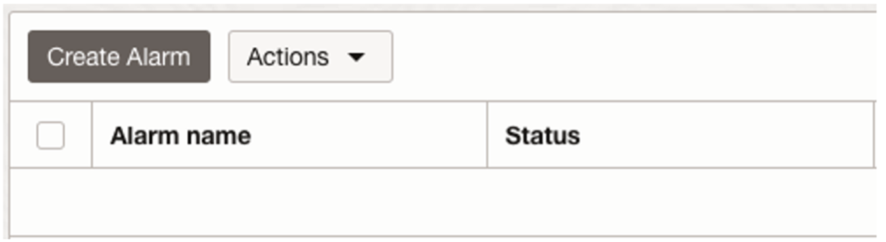

3.	Enter the following information:

- 	Alarm Name: `NODECONDITION`

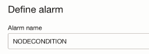

- 	Metric Description:

  -    Compartment: `<Your-Compartment>` 
  -    Metric Namespace: `oci_oke`
  -    Metric name: `KubernetesNodeCondition`

  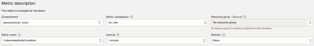

- 	Metric dimensions:

  -	   Dimension name: `clustereId`
  -    Dimension value: `<OKE-Cluster-OCID>`
  -    NodePoolId: `leave blank`

  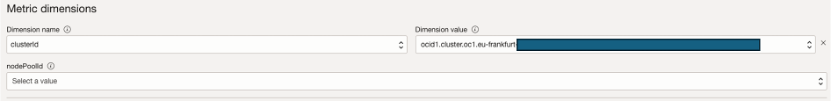

- 	Trigger rule 1 Values:

   -    Operator: `Less than`
   -    Value: `3`
   -    Trigger `delay minutes: 1(default)`
   -    Alarm `severity: Critical`

 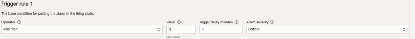

-     Destination:
   -    Destination Service: `Notifications` 
   -    Compartment: `<Your-Compartment>`
   -    Topic: `EmailsTopic`

    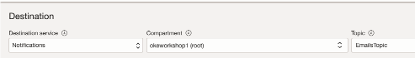

- **Click Save alarm**

---

#### Task 3: Trigger Alarm manually by stopping one of the nodes in the pool

1.	Navigate to Developer Services > Kubernetes Clusters (OKE) > Click Node Pools

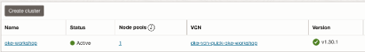

2.	Click Pool Name  

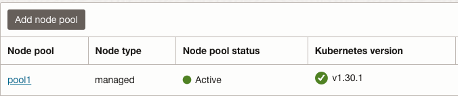

3.	Click on one of the nodes > Click Stop   

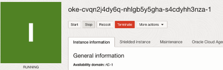

4.	Go back to Alarm view to validate the system identify the false Node and trigger and Alarm 

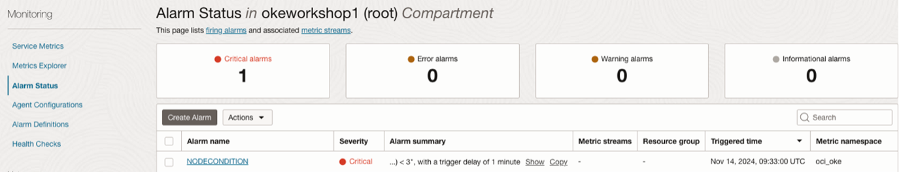

5.	Validate Email notification service works correctly 

>> Go to the Email and validate the following email received:

   
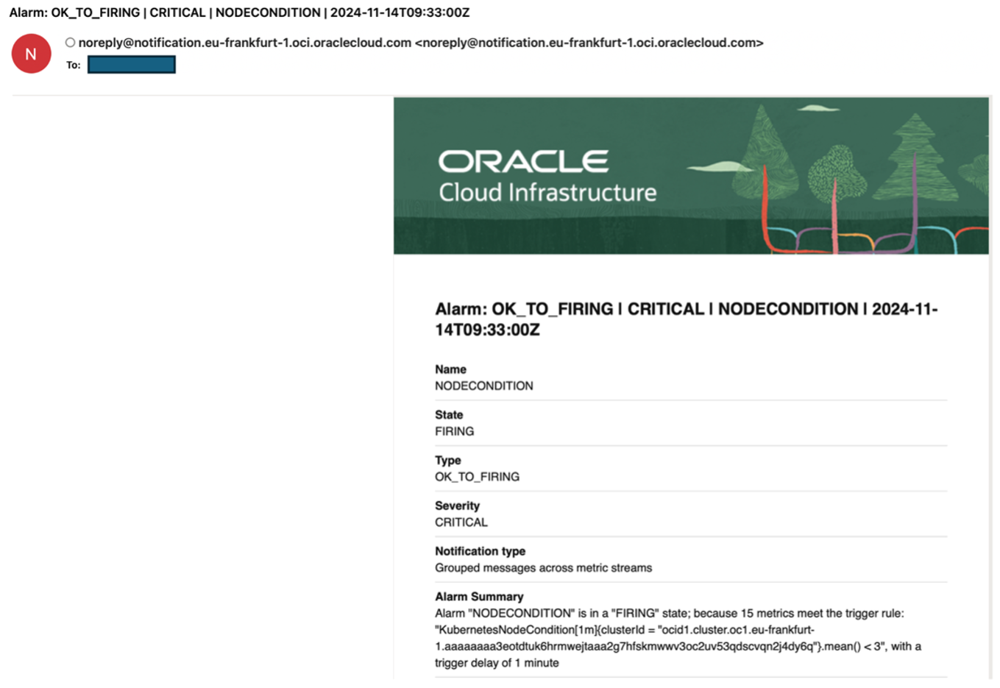

